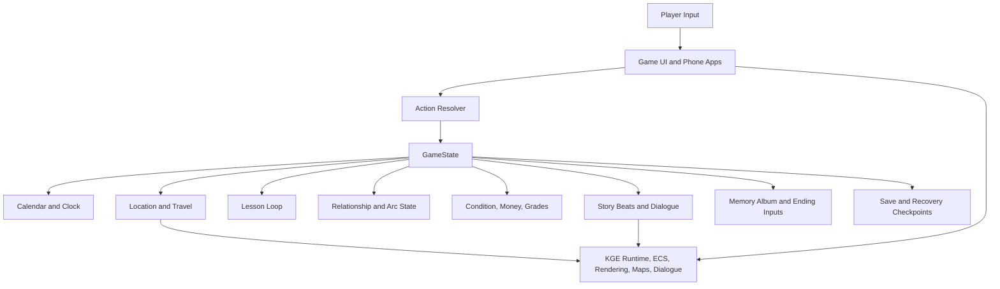

# High School Story Game Architecture Document

## Document Status

This is a review draft. It is intentionally game-architecture focused: it
describes how the game should be structured as a playable social simulation, how
gameplay systems relate to each other, and which architectural decisions should
keep future implementation consistent.

It does not replace `docs/architecture.md`. The current architecture document is
still the technical source for Kotlin Game Engine 2D integration, game/engine
boundaries, runtime composition, package rules, launchers, and preview tooling.
If this draft is accepted, its durable home should be decided explicitly:
promote it into `docs/`, merge selected sections into `docs/architecture.md`, or
keep it as a planning artifact.

## Executive Summary

High School Story is architecturally a calendar-driven school-life simulation
with authored narrative content layered over a compact, stateful daily loop. The
core technical question is not engine selection. The current stack already uses a
Kotlin/JVM game layer on Kotlin Game Engine 2D through the local `engine/`
composite build. The game-architecture question is how to structure time,
actions, locations, lessons, relationships, phone information, condition, money,
grades, content gates, and memory so that the full three-year product can grow
from the Year 1 Semester 1 validation slice without changing its core shape.

The recommended architecture is a **discrete-time, state-first, authored-systems
hybrid**:

- Time advances at explicit boundaries: action completion, travel completion,
  lesson turns, sleep, calendar transitions, exams, year transitions, and ending
  resolution.
- The game state is the coordination surface for calendar, clock, player
  condition, money, grades, relationships, discovered locations, discovered
  preferences, phone data, story flags, memories, and save checkpoints.
- Authoring units are small, state-aware beats rather than monolithic scripts:
  lessons, location actions, classmate arc beats, phone posts, messages, school
  events, club events, exam scenes, memory entries, and graduation epilogues.
- Player-facing planning is diegetic through phone apps instead of abstract
  debug panels.
- The engine provides rendering, ECS, maps, dialogue, input, preview, and
  infrastructure. High School Story owns product-specific simulation rules,
  content gates, pacing, and state interpretation.

## Architecture Goals

1. Preserve the full-game promise: a three-year high school journey ending in
   graduation, not only a semester prototype.
2. Keep Year 1 Semester 1 as a narrow validation slice that proves the daily
   loop, lessons, condition, money, travel, relationships, phone planning, exam
   pressure, and academic failure floor.
3. Make system boundaries clear enough that AI agents can implement features
   without scattering the same rule across scenes, UI, and launch code.
4. Keep simulation discrete and readable; avoid hidden continuous background
   simulation that would make outcomes hard to explain or test.
5. Support authored emotional content without turning narrative state into
   brittle one-off flags.
6. Keep relationship rewards memory-first and systemic bonuses light or absent.
7. Make academic collapse the only hard failure floor; condition and money create
   friction, not run-ending failure.
8. Keep reusable engine concerns out of High School Story game packages.

## Non-Goals

- No multiplayer, online services, matchmaking, or server architecture.
- No large open world, continuous crowd simulation, or background NPC life sim.
- No heavy economy, crafting, itemization, market, investment, or supply-chain
  systems.
- No deep delinquency or truancy simulation.
- No automation or delegation systems that let the player offload daily choices.
- No separate bespoke minigame architecture for each subject.
- No full localization pipeline until localization becomes an accepted feature.
- No engine re-architecture in this document.

## Core Architectural Decisions

| ID | Decision | Rationale | Review Status |
|---|---|---|---|
| GA-1 | Use a discrete-time simulation model. | The GDD says state advances on actions, turns, travel, sleep, and calendar transitions rather than second-by-second management. | Proposed |
| GA-2 | Treat `GameState` as the canonical coordination model. | Beats, actions, phone apps, saves, endings, and previews need one shared state surface. | Proposed |
| GA-3 | Keep beat gating inside beat definitions or action definitions. | Scene eligibility should not drift into launchers, UI, or unrelated orchestration code. | Proposed |
| GA-4 | Represent the daily loop as phases with allowed action contexts. | Morning, school, afternoon, evening, and sleep have different valid choices and constraints. | Proposed |
| GA-5 | Model lessons as a shared turn loop parameterized by subject identity. | The GDD rejects bespoke subject minigames and requires subject feel through weighting and tone. | Proposed |
| GA-6 | Model relationships as descriptive stages plus arc progress. | Player-facing stages avoid raw-number optimization while still allowing deterministic gates. | Proposed |
| GA-7 | Make the phone a read model over game state and authored content. | Calendar, map, profiles, messages, classes, and memories should expose fair planning information diegetically. | Proposed |
| GA-8 | Use compact location records with practical and emotional functions. | Place-first routine and memory need stable location identity without large open-world scope. | Proposed |
| GA-9 | Persist checkpoints at meaningful calendar boundaries. | Academic failure recovery requires saves from about 3 days, 2 weeks, and 2 months earlier. | Proposed |
| GA-10 | Keep authored content modular and state-addressable. | Three years, 10 classmates, clubs, phone content, and memory album require scalable content units. | Proposed |

## High-Level Runtime Shape

## Game State Architecture

`GameState` should evolve from a scene-support type into the product-level state
model for the game layer. It should not become a bag of unrelated booleans. The
state model should be organized around durable domains:

- Calendar: year, semester, week, day, date, day phase, school event schedule,
  exam windows, monthly events, and graduation state.
- Time: clock, base 15-minute increments, current action duration, curfew
  boundary, sleep boundary, and transition rules.
- Player profile: starting interests, academic attributes, broad skills, and
  chosen identity signals.
- Condition: energy, stress, mood, and friction modifiers.
- Money: weekly allowance, current balance, purchases, travel convenience, and
  abstract part-time work outcomes.
- Academics: per-subject standing, lesson history, study history, grade risk,
  exam preparation, exam results, warnings, and failure state.
- Relationships: known classmates, relationship stage, arc progress, discovered
  preferences, availability, current known location, best-friend status, romance
  commitment, conflict/repair tone, and final-year presence.
- Locations: discovered destinations, route availability, travel costs, location
  state, hotspots, and place memory.
- Clubs: discovered clubs, commitments, attendance, club memories, and lighter
  arc progress.
- Phone: messages, posts, profiles, calendar entries, map entries, class/grade
  information, and memory album records.
- Story flags: beat completion, pending hooks, invitations, school events,
  route-specific decisions, and narrative consequences.
- Saves: normal saves plus recovery checkpoints for academic failure.

### State Rules

- State changes should be caused by explicit domain services, actions, or beats.
- UI should read state and request actions; it should not directly mutate
  progression, grades, relationship stage, money, or calendar state.
- Narrative beats may mutate state when their authored consequence is explicit.
- Hidden numeric state may exist, but player-facing surfaces should use
  descriptive stages, visible risks, and readable feedback.
- New state fields should include an owner domain and a known display or
  consequence path.

## Calendar And Daily Loop Architecture

The calendar is the backbone of the game. It should be designed as a durable
progression system before large content expansion.

### Structural Layers

- Full run: three school years.
- Year: Year 1 entry and exploration, Year 2 deepening and choice, Year 3
  culmination and future.
- Semester: academic schedule, events, exams, and outcome reveal.
- Week: weekday obligations plus weekend longer-form options.
- Day: morning, school block, afternoon freedom, dormitory evening, sleep.
- Turn/action: 15-minute increments for lessons and most time-costing actions.

### Day Phase Responsibilities

| Phase | Primary Function | Architectural Notes |
|---|---|---|
| Dormitory morning | Preparation, recovery, study, phone planning, starting state. | Should expose the day's obligations and risks before school. |
| School block | Academic pressure, social hooks, lessons, announcements. | Mostly constrained; supports lessons and school-adjacent beats. |
| Afternoon freedom | Highest-value daily choice. | Main branch point for travel, relationships, clubs, exploration, work, and recovery. |
| Dormitory evening | Recovery, messages, light planning, closure. | Should support late phone content and curfew consequences. |
| Sleep | Date transition and checkpoint creation. | Carries state forward and resolves pending daily effects. |

### Action Validation

Every time-costing action should be validated before it starts:

- Can the action be taken in the current location and phase?
- Does the player have enough time before school, curfew, sleep, event start, or
  another commitment?
- Is the destination discovered and reachable?
- Are money, condition, relationship availability, story flags, and academic
  constraints satisfied?
- If the action is risky but legal, what warning should the player see?

Blocked actions should explain the blocking condition. Risky actions should show
likely consequences before confirmation.

## Lesson And Academic Architecture

Lessons should use one shared architecture:

1. Resolve subject context.
2. Create three 15-minute lesson turns.
3. Present the same core action vocabulary with subject-specific weighting,
   feedback, and tone.
4. Apply turn effects to academic standing, condition, social opportunity, and
   learned subject pattern.
5. Summarize the lesson outcome and carry hooks forward.

Core lesson actions:

- Attentive listening.
- Talking.
- Reading.
- Browsing.
- Napping.

Subject identity should be data-driven enough to avoid duplicating lesson logic
per subject. Each subject can define reward biases, risk tendencies, feedback
phrasing, common hooks, and grade contribution rules.

Academic failure must be readable:

- Grade risk should be inspectable through the phone/classes app.
- Critical danger can trigger at most one explicit academic warning.
- Semester failure should be caused by sustained neglect, not surprise hidden
  math.
- Recovery saves should be offered from about 3 days, 2 weeks, and 2 months
  earlier.

## Relationship And Social Architecture

Relationships should be memory-making systems first and optimization systems
second.

### Relationship State Model

Recommended minimum state per core classmate:

- Known/unknown status.
- Relationship stage: stranger, acquaintance, comfortable, close, very close.
- Arc progress by year or beat chain.
- Discovered preferences and profile facts.
- Current known location and availability, when known.
- Message state and invitation state.
- Shared memories.
- Special bond: none, best friend, romance.
- Conflict/repair tone, if relevant.
- Final-year presence for ending interpretation.

### Relationship Gate Inputs

Arc beats may gate on:

- Calendar year, semester, week, or event timing.
- Relationship stage.
- Arc beat completion.
- Discovered preference or profile fact.
- Location discovery.
- Club context.
- Prior dialogue choice.
- Time, condition, money, curfew, or academic warning.
- Classmate availability.

The phone should expose enough information for fair planning. It should not expose
raw affinity math or full route solutions.

### Capacity Rule

The architecture should preserve meaningful incompleteness. A full run should
support deep progress with about 3-5 classmate arcs, not completion of all 10.
This is a content and pacing rule, not only a balance target.

## Phone And Information Architecture

The phone is the main diegetic information layer. It should be implemented as a
set of read models derived from game state and authored content.

| App | Purpose | Primary Inputs |
|---|---|---|
| Calendar | Lessons, exams, school events, clubs, deadlines, accepted plans. | Calendar state, commitments, events. |
| Map | Discovered destinations, routes, travel costs, expected arrival. | Location and travel state. |
| Social media | Profiles, posts, preferences, known locations, availability, memories. | Relationship state, authored post packs, location hints. |
| Messages | Invitations, replies, planning hooks, personal moments. | Relationship arcs, events, time of day. |
| Classes | Subject standing, grade risk, academic feedback. | Academic state. |
| Memory album | Important scenes, recurring places, endgame recap material. | Story flags, memories, relationships, locations, academics. |

Phone content should be authored, lightweight, and state-aware. It should not
become a simulated internet.

## Location And Travel Architecture

Locations are compact playable spaces, hubs, or scenes with stable identities.
Each recurring place should have:

- A stable identifier.
- A practical function.
- An emotional function.
- Travel connections and costs.
- Available actions by phase.
- Hotspots or interaction points.
- Associated classmates, clubs, events, or arc beats.
- Memory album hooks.

Initial vertical-slice locations may be dormitory, school, district, shop, and
park. The full game can expand toward roughly 15-25 discoverable destinations.
Expansion should add new purpose and memory, not only map volume.

Travel should always preview destination, duration, cost if any, and arrival
time. Travel cannot be allowed to accidentally break school attendance, curfew,
or sleep constraints without readable warning.

## Narrative Content Architecture

Narrative should be authored in modular units that can be scheduled, gated, and
remembered:

- Story beat definitions.
- Dialogue sequences.
- Phone post packs.
- Message chains.
- Classmate arc beats.
- Place discovery hooks.
- Club beats.
- School event scenes.
- Exam and result scenes.
- Memory album entries.
- Year transition summaries.
- Graduation and epilogue fragments.

Playable scenes should continue to use `Story.Beat<GameState>` where that fits
the engine contract. The game layer should add a consistent content registry or
catalog when the number of beats grows enough that ad hoc wiring becomes a drift
risk.

### Authored Content Rule

Authoring should preserve source-of-truth boundaries:

- `docs/narrative-content.md` owns implementation-ready authored prose until a
  more structured content pipeline exists.
- `docs/narrative-design.md` owns narrative design principles and classmate arc
  foundations.
- Code should implement accepted content; it should not silently invent canon.

## Save, Recovery, And Run Outcome Architecture

The save architecture must support ordinary continuation and academic failure
recovery.

Recommended checkpoint classes:

- Current manual or autosave.
- Daily sleep checkpoint.
- Recovery checkpoint near 3 days earlier.
- Recovery checkpoint near 2 weeks earlier.
- Recovery checkpoint near 2 months earlier.
- Semester transition checkpoint.
- Year transition checkpoint.

Academic failure should produce:

- Clear cause summary.
- Current failed state summary.
- Recovery checkpoint choices.
- No condition-based hard failure.

Graduation outcome should compose state rather than choose from a single global
ending label:

- Academic and future direction.
- Relationship stages and arc completion.
- Best-friend and romance status.
- Club identity and club memories.
- Place memories.
- Condition and routine summary.
- Paths not taken.
- Optional post-graduation glimpse.

## Content Scaling Architecture

The full game target is content-heavy. To keep expansion manageable, content
should scale by repeatable structures:

- Subjects share one lesson loop with subject identity data.
- Classmate arcs share state categories but keep route-specific beats and voice.
- Clubs are lighter than classmate arcs and use fewer required milestones.
- Locations use stable records with actions, travel, associated content, and
  memory hooks.
- Phone entries use reusable types: profile fact, post, message, invitation,
  availability hint, memory entry, academic notice.
- Year transitions summarize accumulated state instead of requiring every
  possible path to have bespoke cutscenes.

The Year 1 Semester 1 slice should validate these structures with minimal
content: five locations, five classmates, one fully supported lightweight arc,
shared lessons, condition, money, travel, phone planning, semester exam, and
academic failure handling.

## Game/Engine Boundary

This document preserves the existing technical boundary:

- High School Story owns game state, simulation rules, classmate data, location
  meaning, school calendar, authored content, phone read models, game-specific
  Koin modules, and product-facing behavior.
- KGE owns reusable engine runtime, ECS, rendering, maps, physics, dialogue UI,
  game-object generation, preview infrastructure, and reusable gameplay modules.
- Game code may depend on engine code.
- Engine code must not depend on High School Story packages, assets, story,
  tuning, or product rules.

New reusable behavior belongs in `engine/` only when it is not specific to High
School Story. New High School Story rules belong in `core/`, `lwjgl3/`, assets,
or docs owned by this repository.

## Implementation Pattern Recommendations

These are draft recommendations, not yet accepted implementation contracts:

- Use one game-domain service per major simulation domain: calendar/time,
  actions, travel, lessons, academics, relationships, phone, memory, saves.
- Keep validation and consequence application close together for actions.
- Keep UI as a command/read-model layer.
- Prefer data definitions for subjects, locations, phone entries, and content
  metadata before adding duplicated procedural branches.
- Keep `Story.Beat<GameState>` for playable authored scenes and add cataloging
  only when discovery or scheduling requires it.
- Use explicit result types for action validation and action resolution.
- Let coroutine exceptions propagate unless a local API defines a clearer error
  contract.
- Keep previews focused on playable slices: intro, first weekday, lesson loop,
  travel, phone planning, relationship beat, exam result.

## Epic To Architecture Mapping

| Current/Future Epic Area | Architectural Systems |
|---|---|
| Calendar and Day Structure | Calendar, Clock, Day Phase, Action Validation, Save Checkpoints |
| First Playable Weekday | Daily Loop, Location, Travel, School Block, Sleep Transition |
| Location Travel and Validation | Location Records, Route Graph, Travel Resolver, Action Warnings |
| Lessons and Academic Standing | Lesson Loop, Subject Identity Data, Academic State, Grade Risk |
| Condition, Money, and Recovery | Condition State, Money State, Recovery Actions, Failure Friction |
| Relationships, Profiles, and First Arc | Relationship State, Arc Gates, Phone Profiles, Messages, Memories |
| Semester Exam and Outcome Reveal | Exam Resolver, Academic Summary, Failure Handling, Recovery Saves |
| Player Setup and Starting Identity | Player Profile, Interests, Academic Attributes, Early Modifiers |
| Full Three-Year Progression | Year Transitions, Content Scheduling, Graduation Composition |
| Full Classmate Cast | Modular Arc Content, Capacity Rules, Ending Interpretation |
| Clubs | Club State, Club Events, Location Hooks, Lightweight Arc Progress |
| Lakeview Expansion | Location Records, Place Memories, Travel Graph Expansion |
| Phone App Suite | Read Models, Message/Post Content, Calendar/Map/Class Views |

## Architecture Risks

- The full-game promise can outgrow the architecture if the first slice hardcodes
  one-semester assumptions into core state.
- Relationship content can become unmaintainable if each classmate invents a
  separate state model.
- Phone apps can drift into disconnected UI unless they are read models over the
  same canonical state.
- Academic failure can feel unfair if grade risk and recovery checkpoints are not
  designed with the save architecture from the start.
- Location expansion can dilute the game if new places do not have practical and
  emotional functions.
- Narrative flags can become brittle unless beats, memories, and ending inputs
  use shared categories.
- Existing placeholder Polish dialogue remains drift against the English
  documentation contract.

## Open Questions For Review

1. Should this document become a durable `docs/game-architecture.md`, or should
   selected sections be merged into `docs/architecture.md`?
2. Should `GameState` become the explicit canonical aggregate, or should the
   game use separate domain states composed by a higher-level run state?
3. What is the first accepted save-file format and versioning approach?
4. Which state categories must exist before HSS-4 through HSS-8 implementation
   continues?
5. How much subject identity should be data-driven in the first lesson
   implementation?
6. What exact classmate profile categories are public, discovered, private, or
   route-specific?
7. Should the phone read models be implemented as in-memory projections first,
   with persistence only at the underlying state layer?
8. Which content registry format should be used when authored beats outgrow
   direct wiring?
9. Which preview scenarios are mandatory for validating the first architecture
   slice?

## Review Checklist

- Does this document describe the game architecture rather than only the
  framework architecture?
- Does it preserve the existing game/engine boundary?
- Does it keep Year 1 Semester 1 narrow while supporting the full three-year
  promise?
- Are the proposed decisions small enough to review and either accept, revise, or
  reject?
- Are any implementation recommendations too specific for the current design
  maturity?
- Should any section be promoted into durable docs immediately?

