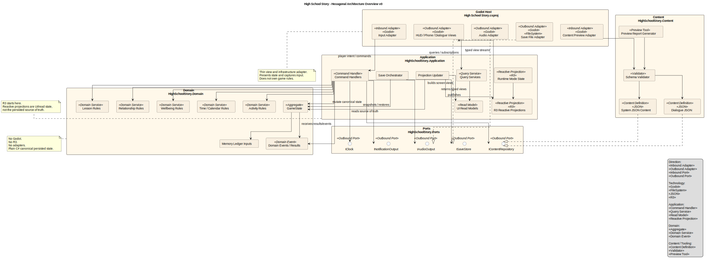

# Game Architecture

## Document Status

This architecture document is being created through the GDS Architecture Workflow.

**Steps Completed:** 4 of 9 (Architectural Decisions)

---

## Project Context

### Game Overview

**High School Story** is a nostalgic school social sim for PC / Steam about guiding a custom dorm student through a constrained high-school semester. The MVP is one 20-week semester, not a compressed full game. The core experience is a daily/weekly loop of lessons, travel, relationship attention, wellbeing, phone discovery, events, exams, and reflection.

### Technical Scope

**Platform:** PC / Steam first; Steam Deck-conscious where low-cost.  
**Engine Direction:** Godot; Step 3 should validate the Godot + C#/.NET boundary and starter/project layout, not reopen the engine question from zero.  
**Architecture Starting Hypothesis:** Godot as presentation/infrastructure adapter; clean C#/.NET domain isolated from Godot APIs.  
**Genre:** School-life social simulation / time-management / relationship sim.  
**Project Level:** High complexity for solo-dev because of content authoring, calendar state, relationship flags, and save-state correctness.

### Core Systems

| System | Complexity | Source |
| --- | --- | --- |
| Time / Calendar / 15-minute blocks | High | GDD E1 |
| Travel / location feasibility | Medium-High | GDD E1, UX |
| Sleep / wake / daily boundary / end-of-day summary | Medium-High | GDD E1/E2/E9, UX |
| Wellbeing: Energy / Stress / Mood | High | GDD E2 |
| Activity availability and resolution | High | GDD E2, UX |
| Lessons: 3 blocks, teacher attention/checks | High | GDD E3 |
| Academics: subjects, homework, tests, exams, grades | High | GDD E3 |
| Relationships: Bond, tiers, flags, authored beats | High | GDD E4, NDD |
| Narrative gating / story flags / Memory Ledger | High | NDD |
| Smartphone apps: Calendar, Map, Social, Messages, School App, Settings | High | GDD E5, UX |
| Locations / clubs / fixed and triggered events | High | GDD E6 |
| Character creation / preferences / identity | Medium | GDD E7 |
| Dialogue modes and UI state surfaces | High | UX, NDD |
| Save / load / checkpoints / safe manual save | High | GDD E9 |
| Content authoring pipeline | High | GDD, NDD, UX |

### Technical Requirements

- Sustain 60 FPS during representative school navigation, phone use, lessons, dialogue, travel, and day transition.
- PC first, Steam Deck readability and controller focus designed from the start.
- Scene transition target under 2 seconds; save/load and day transition under 3 seconds.
- No online multiplayer or networking requirement.
- Save model must avoid unstable contexts: no manual save during lessons, exams, action resolution, or other transient states.
- UI must be controller-first, keyboard-compatible, mouse auxiliary.
- Phone is the major information/system hub, but not a remote activity executor.
- Activities trigger through world presence: NPCs, objects, locations, events.
- Content must be data-authored where possible: calendars, activities, effects, flags, dialogues, availability, feedback, and events.
- Authoring data needs validation/preview tooling for calendar conflicts, availability conditions, flags, effects, and dialogue/event variants without manually playing a full semester for every check.

### Complexity Drivers

**High Complexity**

- Calendar/time as the central game grammar.
- Relationship progression requiring Bond/tier plus flags, context, timing, location, and authored beats.
- Lessons as repeated gameplay, not passive schedule skips.
- Save-state correctness across long semester progression.
- Content authoring and validation for many small conditions and variants.
- UI state orchestration across top-down exploration, phone overlays, lesson mode, dialogue, and activity overlays.

**Novel / Special Attention**

- Hexagonal-style Godot/C# split: domain must not depend on Godot.
- Phone-as-menu and phone-as-information-hub.
- Activity choice as top-down overlay, not menu-driven remote scheduling.
- Lesson flow as school-pressure "turn structure" without combat framing.
- Mood as qualitative state derived from pressures/tags, not just a third meter.
- Memory Ledger / semester reflection as accumulated interpretation, not epilogue closure.
- Memory Ledger as interpretive reflection over accumulated state, missed chances, relationships, academics, and wellbeing, not a quest log.

### Technical Risks

- Overfitting the domain model to Godot node structure.
- Coding story beats, activities, or calendar events directly into scenes.
- Letting relationship progression collapse into simple `Bond >= X`.
- Building UI surfaces before defining domain state and commands.
- Underestimating save/load and content validation complexity.
- Making beautiful systems that do not serve GDD/UX player-facing loops.

---

## Engine & Framework

### Selected Engine

**Godot Engine 4.7 (.NET build)** with **Godot.NET.Sdk/4.7.0**.

**Rationale:** Godot matches the project’s 2D pixel-art school-life sim needs, PC/Steam-first scope, low/no licensing cost, strong 2D scene workflow, and the project requirement to isolate domain logic from engine APIs. Godot is selected as the presentation/infrastructure shell, not as the owner of game rules.

### Runtime / Language Baseline

- Engine: Godot 4.7 .NET build.
- Godot SDK: `Godot.NET.Sdk/4.7.0`.
- Project target: `net10.0`, intentionally overriding the Godot-generated `net8.0` baseline.
- Language direction: modern C# aligned with .NET 10 where compatible.
- Local validation gate: .NET 10 SDK must be installed and verified before the first architecture spike build.
- Godot-generated Android target fallback remains untouched for now because Android is not an MVP target.
- Web export is not a target; Godot C# web export limitations are acceptable.

Verified sources on 2026-07-02:

- Godot 4.7 release page: `https://godotengine.org/releases/4.7/`
- Godot C# documentation and .NET SDK requirement: `https://docs.godotengine.org/en/stable/tutorials/scripting/c_sharp/c_sharp_basics.html`
- GodotSharp .NET 8 minimum / latest .NET support note: `https://godotengine.org/article/godotsharp-packages-net8/`
- .NET downloads and support lifecycle: `https://dotnet.microsoft.com/en-us/download/dotnet`, `https://dotnet.microsoft.com/en-us/platform/support/policy/dotnet-core`
- C# 14 language update: `https://learn.microsoft.com/en-us/dotnet/csharp/whats-new/csharp-14`

### Project Initialization

Use the **Godot-generated C# solution as the host**, then expand it into a multi-project .NET solution with explicit dependency boundaries.

Current generated files:

```text
High School Story.sln
High School Story.csproj
project.godot
src/
```

Architecture target:

```text
High School Story.sln
High School Story.csproj        # Godot presentation / composition root

src/
  HighSchoolStory.Domain/
  HighSchoolStory.Application/
  HighSchoolStory.Ports/
  HighSchoolStory.Content/

tests/
  HighSchoolStory.Domain.Tests/
  HighSchoolStory.Application.Tests/
  HighSchoolStory.Architecture.Tests/
```

Initial dependency direction:

```text
High School Story.csproj
  -> HighSchoolStory.Application
  -> HighSchoolStory.Ports
  -> HighSchoolStory.Content

HighSchoolStory.Application
  -> HighSchoolStory.Domain
  -> HighSchoolStory.Ports

HighSchoolStory.Domain
  -> no Godot
  -> no adapters
  -> no infrastructure
```

### Domain-First Authoring Rule

Engine selection must preserve domain-first authoring: Godot scenes and nodes present state and collect input; calendar rules, activity availability, relationship gates, lesson resolution, wellbeing effects, memory flags, and save-state semantics live outside Godot-specific code.

Godot may own:

- Scene composition and visual hierarchy.
- Input action collection.
- UI rendering, focus, and transitions.
- Audio/visual playback.
- Asset loading and engine integration.
- Thin adapters that translate player input into application commands and render application/domain results.

Godot must not own:

- Calendar/time rules.
- Travel feasibility.
- Activity availability and resolution.
- Lesson action resolution.
- Relationship gates and authored beat eligibility.
- Wellbeing effect semantics.
- Memory Ledger interpretation inputs.
- Save-state semantics.
- Content validation rules.

### Engine-Provided Architecture

| Component | Solution | Notes |
| --- | --- | --- |
| Rendering | Godot 2D renderer | Pixel-art top-down exploration, phone overlays, HUD, dialogue presentation. |
| Scene Management | Godot scene tree and `.tscn` scenes | Presentation composition only; domain state is not derived from node hierarchy. |
| UI | Godot `Control` / `CanvasLayer` | Implements controller-first focus, Steam Deck readability, phone/HUD/dialogue overlays. |
| Input | Godot input actions | Inbound adapter maps physical input to application commands. |
| Audio | Godot audio buses and players | Outbound adapter presents domain/application audio intents. |
| Asset Pipeline | Godot import pipeline | Visual/audio assets live in Godot; rules/content definitions need validation outside scene code. |
| Build / Export | Godot export pipeline | PC/Steam first; Steam Deck-conscious. |
| Editor Workflow | Godot editor plus external C# IDE | Godot scripts/adapters stay thin; domain code uses normal .NET project structure. |

### Starter / Template Decision

Do not adopt a full third-party Godot starter template as the architecture foundation.

Chickensoft `GodotGame` is useful as a reference for Godot + C# setup, launch configuration, tests, coverage, `global.json`, and CI ideas, but this project needs a stricter Hexagonal boundary than a general Godot starter provides.

### Development Tools / MCP

Recommended optional AI-assisted development tools:

| Tool | Role | Notes |
| --- | --- | --- |
| GoPeak Godot MCP | Godot edit-run-inspect loop | Useful for scene inspection, screenshots, diagnostics, live scene tree, and compact AI-assisted workflows. Development tooling only; not runtime architecture. |
| Context7 | Current documentation lookup | Useful for Godot/.NET/C# API verification during implementation. Development tooling only. |

These tools must not influence runtime architecture or create a dependency between domain logic and Godot editor workflows.

### Architecture Diagram Companions

Architecture diagrams are maintained as editable PlantUML sources plus rendered SVG artifacts for Markdown reading.



Source: `game-architecture-diagrams/hexagonal-overview.puml`

### Remaining Architectural Decisions

The following decisions still need to be made explicitly in later steps:

- Exact C# project references and allowed dependency direction.
- Domain command/query boundary.
- Application service boundaries for day loop, travel, activity resolution, lessons, phone, dialogue, and save/load.
- Content authoring format and validation tooling.
- Save-state ownership, serialization boundary, and safe-save state machine.
- Godot adapter patterns for UI, scene transitions, input, audio, persistence, and content loading.
- Testing pyramid: pure domain tests, application tests, architecture dependency tests, and Godot integration smoke tests.
- State machine boundaries for exploration, phone, lessons, dialogue, activity overlays, travel, daily transitions, and semester reflection.

---

## Architectural Decisions

### Decision Summary

| Category | Decision | Rationale |
| --- | --- | --- |
| Layering | Domain + Application + Ports + Godot Host | Enforces a Hexagonal boundary around clean game rules. |
| Ports | Separate `HighSchoolStory.Ports` project | Keeps adapter contracts explicit and testable. |
| Application Boundary | Hybrid commands + typed query/read models | Mutations are explicit; UI gets screen-ready projections. |
| State Ownership | Domain persisted state + Application runtime/UI state | Godot stays thin; canonical state is engine-independent. |
| Save System | Versioned JSON snapshots + document migrations | Debuggable, MVP-friendly, migration-ready. |
| Content Authoring | JSON systems + custom JSON dialogue | Validatable and engine-independent. |
| Content Validation | CLI/reports + Godot preview as adapter | Core validation stays outside Godot; editor preview remains useful. |
| Runtime/UI State | Application-owned, R3-backed reactive projections | Godot subscribes and renders; it does not own UI state. |
| R3 Boundary | R3 in Application/Godot, not Domain | Domain stays deterministic; Application projects events to R3. |
| Dependencies | Domain has no refs; Ports -> Domain; Application -> Domain/Ports/R3 | Prevents cycles and engine leakage. |
| Save Ownership | Application orchestrates save; Godot adapter writes files | Save legality and envelope live outside Godot. |
| Diagrams | `.puml` source + rendered `.svg` in Markdown | Visual architecture evolves with the document. |
| Diagram Vocabulary | Multi-stereotype PlantUML roles | Direction and technology are separate labels. |
| Domain Modeling | Pragmatic DDD inside Hexagonal Architecture | DDD models the rules; Hexagonal protects them. |
| Aggregate Boundary | `GameSession` / `GameState` root with internal state modules | Single save/transaction root without one giant rule object. |
| Domain Rules | Methods, services, policies, specifications, events | Keeps rules explicit and testable. |
| Conditions / Effects | Typed JSON first; optional limited expressions later | Strong validation before convenience. |
| Content Loading | Load validated content into `ContentCatalog` at startup | Avoids mid-session file/runtime surprises. |
| Input | Godot InputMap -> Input Adapter -> Application intents | Device handling in Godot, meaning in Application. |
| Scene Composition | Persistent Godot shell + presentation views | Runtime mode comes from Application, not scenes. |
| Location Loading | Scene per location + async transitions | Practical for MVP, with Application-owned logical location. |
| Audio | Application emits audio intents through port | Godot plays; Domain never knows audio assets. |
| Notifications | Application-owned R3 notification/read state | Toasts/badges are UI projections, not domain copy. |
| Testing | Domain/Application/Content tests + architecture tests + Godot smoke tests | Tests prove rules outside the engine. |
| Enforcement | `.csproj` boundaries + architecture tests | Compiler and tests guard the architecture. |
| Platform Services | Steam-ready ports, local-first MVP | Prepared for Steam Cloud without early integration cost. |

### Core Layer Rules

`HighSchoolStory.Domain` is plain C# with no Godot, no R3, no Ports, no Application, no Content, and no adapters. It owns canonical persisted gameplay state, game rules, domain services, policies, specifications, value objects, and domain events.

`HighSchoolStory.Ports` defines adapter contracts. It may reference Domain for IDs, value objects, and stable result types, but it must not expose mutable aggregates unless explicitly approved.

`HighSchoolStory.Application` owns command handlers, query services, runtime mode, save orchestration, R3 projections, read models, and side-effect orchestration through ports.

`HighSchoolStory.Content` owns JSON loaders, schema validation, content validation, preview reports, and runtime `ContentCatalog` / repository implementations. `IContentRepository` lives in Ports; JSON/content implementations live in Content.

`High School Story.csproj` is the Godot host and composition root. It owns scene composition, input capture, rendering, animation playback, resource handles, and concrete engine/infrastructure adapters.

### Project References

```text
HighSchoolStory.Domain
  references:
    - none

HighSchoolStory.Ports
  references:
    - HighSchoolStory.Domain

HighSchoolStory.Application
  references:
    - HighSchoolStory.Domain
    - HighSchoolStory.Ports
    - R3

HighSchoolStory.Content
  references:
    - HighSchoolStory.Domain
    - HighSchoolStory.Ports
    - JSON / schema tooling as needed

High School Story.csproj
  references:
    - HighSchoolStory.Application
    - HighSchoolStory.Ports
    - HighSchoolStory.Content
    - R3
    - Godot.NET.Sdk
```

### Application Boundary

The Application layer uses a hybrid command/query boundary.

Commands represent player or system intentions that may mutate state:

```text
TravelToLocationCommand
StartActivityCommand
ChooseLessonActionCommand
SelectDialogueOptionCommand
EndDayCommand
SaveGameCommand
```

Queries return typed read models / projections:

```text
HudView
PhoneCalendarView
PhoneMapView
PhoneSocialProfileView
ActivityChoiceView
LessonView
DialogueView
EndOfDaySummaryView
SemesterReflectionView
```

Godot must not read domain aggregates directly to assemble UI. Application query services produce screen-specific read models shaped by UX rules, including hiding exact relationship/risk math where required.

### Reactive UI Rule

R3 is approved for Application/Godot reactive state. Verified current version on 2026-07-03: `R3 v1.3.1`.

R3 starts at the Application boundary. Domain emits deterministic results/domain events; Application updates reactive projections from canonical `GameState`.

```text
Command
  -> Application handler
  -> Domain mutation
  -> Domain result/events
  -> Application projection updater
  -> R3 read model streams
  -> Godot rendering
```

Reactive projections are UI/read state, not the persisted source of truth. After loading a save, Application rebuilds R3 projections from canonical `GameState`.

### State Ownership

Domain owns canonical persisted gameplay state:

```text
TimeState
CalendarState
PlayerState
WellbeingState
LocationState
RelationshipBook
AcademicRecord
StoryFlagSet
Wallet
MemoryLedgerInputs
```

Application owns runtime mode, command legality, save legality, transient flow state, screen state, and R3 projections.

Godot owns rendering implementation details only:

```text
Node references
AnimationPlayer progress
Tween handles
Loaded resource handles
Actual engine focus object
Camera smoothing internals
```

Godot must not own runtime mode, save legality, activity choice state, lesson block state, dialogue flow state, or phone screen state.

### Save System

Save system uses versioned JSON snapshots wrapped in an envelope, with document-level migrations before deserialization into current domain/application types.

```text
SaveGameEnvelope
  SchemaVersion
  GameVersion
  ContentVersion
  SavedAt
  SlotMetadata
  Payload
  PlatformId?
  DeviceId?
  CloudRevision?
  LastSyncedAt?
```

Application owns save orchestration:

- checks save eligibility;
- builds the save envelope;
- runs migrations and validation on load;
- replaces/restores canonical state;
- rebuilds R3 projections;
- performs autosave at start/end day;
- blocks manual save during transient states.

Godot implements file access through `ISaveStore`; it does not serialize node trees as source of truth and does not decide whether saving is legal.

### Content Authoring

System content is JSON and schema-validated:

```text
calendar events
activities
effects
availability
lessons
academics
relationships
phone/social data
events
```

Dialogue/story content uses custom JSON for MVP. The MVP subset must remain small:

- typed nodes;
- typed choices;
- typed conditions;
- typed effects;
- flags;
- no full DSL at start;
- no arbitrary scripting in dialogue content;
- validation and readable reports required.

Conditions/effects use typed JSON first, with an optional limited expression language later only if verbosity becomes a proven authoring problem.

### Content Validation

Core validation is engine-independent and runs through CLI/reports. Godot preview tooling may exist as an adapter over the same validation/preview core.

Validation must cover design correctness, not only JSON syntax:

- schema correctness;
- calendar conflicts;
- impossible availability;
- dead dialogue nodes;
- unknown IDs/flags/characters/events;
- missing non-club variants;
- missing dialogue variants;
- activities without time/energy/stress/mood feedback;
- phone clues without reachable world occasions;
- effect validation;
- save/content version compatibility.

Runtime command handlers must not perform ad-hoc file reads. Validated content is loaded into `ContentCatalog` at startup for MVP, with a later path toward a precompiled content bundle if needed.

### World-Presence Rule

Phone apps may show clues, calendars, maps, profiles, messages, and known facts. They must not execute ordinary activities remotely.

`StartActivityCommand` requires a valid world context:

```text
Current Location
Interaction Context
Activity Occasion
Availability Result
Feasibility Result
```

This protects the UX rule that activities happen through presence in the world: NPCs, objects, locations, and events.

### Runtime Modes and Scene Composition

Runtime mode is Application-owned. Godot uses a persistent presentation shell and concrete views that subscribe to Application state.

```text
GameRoot.tscn
  WorldLayer
  UILayer
  TransitionLayer
  AudioLayer
  DebugLayer
```

Presentation views include:

```text
ExplorationView
HudView
PhoneView
ActivityChoiceOverlay
LessonView
DialogueView
TravelTransitionView
EndOfDayView
SaveLoadView
```

Location loading uses scene-per-major-location plus async transitions. Application owns logical location and travel legality; Godot loads and renders the corresponding scene.

### Input

Input uses Godot InputMap through a thin input adapter:

```text
Godot InputMap
  -> GodotInputAdapter
  -> Application intent/command
```

Godot captures device input; Application interprets intent in the current runtime mode.

Example intents:

```text
InteractPressed
OpenPhonePressed
BackPressed
ConfirmPressed
CancelPressed
MoveFocus(Direction)
SelectTab(Direction)
NavigatePhoneApp(AppId)
```

Logical focus/selection state for application screens belongs to Application reactive UI state, even when Godot has a technical focused `Control`.

### Audio and Notifications

Audio is Application-driven through outbound ports. Domain may emit semantic events, but not concrete sound cues.

```text
Domain result/event
  -> Application maps to AudioCue / MusicCue
  -> IAudioOutput
  -> GodotAudioAdapter
```

Notifications and badges are Application-owned R3 projections:

```text
Domain result/event
  -> Application maps to ToastView / BadgeState
  -> R3 notification stream or queue
  -> Godot renders toast / badge / feedback
```

Domain does not emit UI copy.

### Domain Modeling

The architecture uses pragmatic Domain-Driven Design inside a Hexagonal Architecture boundary. DDD models the game rules; Hexagonal Architecture protects those rules from Godot, files, UI, save, audio, and platform infrastructure.

Domain concepts are modeled as aggregates, entities, value objects, domain services, policies, specifications, and domain events where they clarify game rules. Avoid ceremony unless it protects correctness, testability, or content authoring clarity.

`GameSession` / `GameState` is the MVP aggregate root and save/transaction root. It contains internal bounded state modules. Complex rules live in domain services, policies, or specifications rather than turning the root into a rule dump.

Rules organization:

```text
Aggregate / State Object methods
  simple invariant-preserving mutations

Domain Services
  multi-state calculations or resolutions

Policies
  decision rules returning allowed / blocked / warning with reasons

Specifications
  reusable authored/content conditions

Domain Events
  semantic facts emitted after mutation
```

Memory Ledger / Semester Reflection is not a normal event log. It interprets accumulated state, flags, missed chances, relationships, academics, wellbeing patterns, and selected significant-choice records.

### Testing and Enforcement

Testing strategy:

```text
Many:
  Domain unit tests
  Application command/query tests
  Content validation tests

Some:
  Architecture dependency tests
  Save migration tests
  Read model snapshot tests

Few:
  Godot adapter smoke tests
  Scene load tests
  Input command wiring tests
```

No gameplay rule is considered tested only because it worked in a Godot scene.

Architecture is enforced through separate `.csproj` boundaries, explicit project references, and architecture tests. Future tooling may use ArchUnitNET or custom reflection tests after version verification.

### Platform Services

Platform services are port-based and Steam-ready, but local-first in MVP.

MVP uses local JSON snapshot saves. Steam Cloud integration is deferred, but the save envelope includes future cloud/conflict metadata fields. Domain and Application rules do not depend on Steam.

Potential future ports:

```text
IPlatformSaveSync
IPlatformEntitlements
IPlatformAchievements
```

Initial implementations may include `NoOpPlatformSaveSync`.

### Diagram Artifacts

Architecture diagrams are maintained as editable PlantUML sources plus rendered SVGs for Markdown reading.

Current companion:

- `game-architecture-diagrams/hexagonal-overview.puml`
- `game-architecture-diagrams/hexagonal-overview.svg`

Stereotypes use multiple labels rather than fake inheritance:

```plantuml
component "Godot Input Adapter" <<Inbound Adapter>> <<Godot>>
component "Godot Save File Adapter" <<Outbound Adapter>> <<Godot>> <<FileSystem>>
component "HUD View Stream" <<Reactive Projection>> <<R3>>
```

Vocabulary v1:

```text
Direction:
  <<Inbound Adapter>>
  <<Outbound Adapter>>
  <<Inbound Port>>
  <<Outbound Port>>

Technology:
  <<Godot>>
  <<FileSystem>>
  <<JSON>>
  <<Steam>>
  <<R3>>

Application:
  <<Command Handler>>
  <<Query Service>>
  <<Application Service>>
  <<Read Model>>
  <<Reactive Projection>>

Domain:
  <<Aggregate>>
  <<Entity>>
  <<Value Object>>
  <<Domain Service>>
  <<Domain Event>>
  <<Policy>>
  <<Specification>>

Content / Tooling:
  <<Content Definition>>
  <<Validator>>
  <<Preview Tool>>
```

### Vertical Slice Safety Rule

MVP architecture must prove an early vertical slice before expanding authoring tooling:

```text
day loop
activity occasion
lesson flow
phone hub clue
one relationship beat
save/load
content validation report
```

Content systems may grow only after this slice remains authorable and testable.
