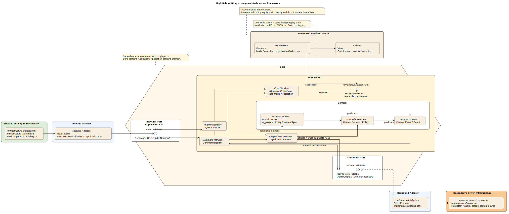

## Executive Summary

**High School Story** architecture is designed for Godot 4.7 .NET targeting PC / Steam, with Steam Deck-conscious UI constraints.

**Key Architectural Decisions:**

- Godot is treated as presentation/infrastructure host; gameplay rules live in clean C# projects outside Godot-specific code.
- The core architecture is Hexagonal Architecture with pragmatic DDD: Domain owns canonical rules/state, Application owns commands/queries/runtime projections, Ports define adapter contracts, and Infrastructure/Godot implements adapters.
- MVP implementation is constrained by the vertical slice rule: prove day loop, activity occasion, lesson flow, phone clue, relationship beat, save/load, and content validation before expanding tooling.

**Project Structure:** Domain-driven / Hexagonal hybrid organization with 15 core systems mapped across Domain, Application, Content, Ports, Godot Infrastructure, tools, and tests.

**Implementation Patterns:** 8 novel patterns plus standard patterns for communication, creation, state transitions, data access, typed errors, architecture tests, and vertical slice build order.

**Ready for:** Epic implementation phase.

# Game Architecture

## Document Status

This architecture document was created through the GDS Architecture Workflow.

**Steps Completed:** 9 of 9 (Complete)

---

## Development Environment

### Prerequisites

- Godot Engine 4.7 .NET build.
- `Godot.NET.Sdk/4.7.0`.
- .NET 10 SDK.
- Git.
- IDE/editor with C# support.
- Optional PlantUML/Kroki tooling for rendering architecture diagrams.

### AI Tooling (MCP Servers)

No engine-specific MCP servers were selected. They can be added later if Godot scene inspection or asset-aware AI tooling becomes useful.

### Setup Commands

```powershell
dotnet --version
dotnet restore "High School Story.sln"
dotnet build "High School Story.sln"
dotnet test
dotnet run --project tools/HighSchoolStory.ContentValidator -- content/mvp --profile vertical-slice
dotnet run --project tools/HighSchoolStory.ScenarioRunner -- content/fixtures/vertical-slice/one-school-day.json
```

### First Steps

1. Verify .NET 10 SDK and Godot 4.7 .NET are installed.
2. Create or verify the project structure from this architecture document.
3. Add project references and root Godot `.csproj` compile exclusions.
4. Build the first vertical slice in the documented order.

---

## Project Context

### Game Overview

**High School Story** is a nostalgic school social sim for PC / Steam about guiding a custom dorm student through a constrained high-school semester. The MVP is one 20-week semester, not a compressed full game. The core experience is a daily/weekly loop of lessons, travel, relationship attention, wellbeing, phone discovery, events, exams, and reflection.

### Technical Scope

**Platform:** PC / Steam first; Steam Deck-conscious where low-cost.  
**Engine Direction:** Godot; Step 3 should validate the Godot + C#/.NET boundary and starter/project layout, not reopen the engine question from zero.  
**Architecture Starting Hypothesis:** Godot as presentation/infrastructure adapter; clean C#/.NET domain isolated from Godot APIs.  
**Genre:** School-life social simulation / time-management / relationship sim.  
**Project Level:** High complexity for solo-dev because of content authoring, calendar state, relationship flags, and save-state correctness.

### Core Systems

| System | Complexity | Source |
| --- | --- | --- |
| Time / Calendar / 15-minute blocks | High | GDD E1 |
| Travel / location feasibility | Medium-High | GDD E1, UX |
| Sleep / wake / daily boundary / end-of-day summary | Medium-High | GDD E1/E2/E9, UX |
| Wellbeing: Energy / Stress / Mood | High | GDD E2 |
| Activity availability and resolution | High | GDD E2, UX |
| Lessons: 3 blocks, teacher attention/checks | High | GDD E3 |
| Academics: subjects, homework, tests, exams, grades | High | GDD E3 |
| Relationships: Bond, tiers, flags, authored beats | High | GDD E4, NDD |
| Narrative gating / story flags / Memory Ledger | High | NDD |
| Smartphone apps: Calendar, Map, Social, Messages, School App, Settings | High | GDD E5, UX |
| Locations / clubs / fixed and triggered events | High | GDD E6 |
| Character creation / preferences / identity | Medium | GDD E7 |
| Dialogue modes and UI state surfaces | High | UX, NDD |
| Save / load / checkpoints / safe manual save | High | GDD E9 |
| Content authoring pipeline | High | GDD, NDD, UX |

### Technical Requirements

- Sustain 60 FPS during representative school navigation, phone use, lessons, dialogue, travel, and day transition.
- PC first, Steam Deck readability and controller focus designed from the start.
- Scene transition target under 2 seconds; save/load and day transition under 3 seconds.
- No online multiplayer or networking requirement.
- Save model must avoid unstable contexts: no manual save during lessons, exams, action resolution, or other transient states.
- UI must be controller-first, keyboard-compatible, mouse auxiliary.
- Phone is the major information/system hub, but not a remote activity executor.
- Activities trigger through world presence: NPCs, objects, locations, events.
- Content must be data-authored where possible: calendars, activities, effects, flags, dialogues, availability, feedback, and events.
- Authoring data needs validation/preview tooling for calendar conflicts, availability conditions, flags, effects, and dialogue/event variants without manually playing a full semester for every check.

### Complexity Drivers

**High Complexity**

- Calendar/time as the central game grammar.
- Relationship progression requiring Bond/tier plus flags, context, timing, location, and authored beats.
- Lessons as repeated gameplay, not passive schedule skips.
- Save-state correctness across long semester progression.
- Content authoring and validation for many small conditions and variants.
- UI state orchestration across top-down exploration, phone overlays, lesson mode, dialogue, and activity overlays.

**Novel / Special Attention**

- Hexagonal-style Godot/C# split: domain must not depend on Godot.
- Phone-as-menu and phone-as-information-hub.
- Activity choice as top-down overlay, not menu-driven remote scheduling.
- Lesson flow as school-pressure "turn structure" without combat framing.
- Mood as qualitative state derived from pressures/tags, not just a third meter.
- Memory Ledger / semester reflection as accumulated interpretation, not epilogue closure.
- Memory Ledger as interpretive reflection over accumulated state, missed chances, relationships, academics, and wellbeing, not a quest log.

### Technical Risks

- Overfitting the domain model to Godot node structure.
- Coding story beats, activities, or calendar events directly into scenes.
- Letting relationship progression collapse into simple `Bond >= X`.
- Building UI surfaces before defining domain state and commands.
- Underestimating save/load and content validation complexity.
- Making beautiful systems that do not serve GDD/UX player-facing loops.

---

## Engine & Framework

### Selected Engine

**Godot Engine 4.7 (.NET build)** with **Godot.NET.Sdk/4.7.0**.

**Rationale:** Godot matches the project’s 2D pixel-art school-life sim needs, PC/Steam-first scope, low/no licensing cost, strong 2D scene workflow, and the project requirement to isolate domain logic from engine APIs. Godot is selected as the presentation/infrastructure shell, not as the owner of game rules.

### Runtime / Language Baseline

- Engine: Godot 4.7 .NET build.
- Godot SDK: `Godot.NET.Sdk/4.7.0`.
- Project target: `net10.0`, intentionally overriding the Godot-generated `net8.0` baseline.
- Language direction: modern C# aligned with .NET 10 where compatible.
- Local validation gate: .NET 10 SDK must be installed and verified before the first architecture spike build.
- Godot-generated Android target fallback remains untouched for now because Android is not an MVP target.
- Web export is not a target; Godot C# web export limitations are acceptable.

Verified sources on 2026-07-02:

- Godot 4.7 release page: `https://godotengine.org/releases/4.7/`
- Godot C# documentation and .NET SDK requirement: `https://docs.godotengine.org/en/stable/tutorials/scripting/c_sharp/c_sharp_basics.html`
- GodotSharp .NET 8 minimum / latest .NET support note: `https://godotengine.org/article/godotsharp-packages-net8/`
- .NET downloads and support lifecycle: `https://dotnet.microsoft.com/en-us/download/dotnet`, `https://dotnet.microsoft.com/en-us/platform/support/policy/dotnet-core`
- C# 14 language update: `https://learn.microsoft.com/en-us/dotnet/csharp/whats-new/csharp-14`

### Project Initialization

Use the **Godot-generated C# solution as the host**, then expand it into a multi-project .NET solution with explicit dependency boundaries.

Current generated files:

```text
High School Story.sln
High School Story.csproj
project.godot
src/
```

Architecture target:

```text
High School Story.sln
High School Story.csproj        # Godot presentation / composition root

src/
  HighSchoolStory.Domain/
  HighSchoolStory.Application/
  HighSchoolStory.Ports/
  HighSchoolStory.Content/

tests/
  HighSchoolStory.Domain.Tests/
  HighSchoolStory.Application.Tests/
  HighSchoolStory.Architecture.Tests/
```

Initial dependency direction:

```text
High School Story.csproj
  -> HighSchoolStory.Application
  -> HighSchoolStory.Ports
  -> HighSchoolStory.Content

HighSchoolStory.Application
  -> HighSchoolStory.Domain
  -> HighSchoolStory.Ports

HighSchoolStory.Domain
  -> no Godot
  -> no adapters
  -> no infrastructure
```

### Domain-First Authoring Rule

Engine selection must preserve domain-first authoring: Godot scenes and nodes present state and collect input; calendar rules, activity availability, relationship gates, lesson resolution, wellbeing effects, memory flags, and save-state semantics live outside Godot-specific code.

Godot may own:

- Scene composition and visual hierarchy.
- Input action collection.
- UI rendering, focus, and transitions.
- Audio/visual playback.
- Asset loading and engine integration.
- Thin adapters that translate player input into application commands and render application/domain results.

Godot must not own:

- Calendar/time rules.
- Travel feasibility.
- Activity availability and resolution.
- Lesson action resolution.
- Relationship gates and authored beat eligibility.
- Wellbeing effect semantics.
- Memory Ledger interpretation inputs.
- Save-state semantics.
- Content validation rules.

### Engine-Provided Architecture

| Component | Solution | Notes |
| --- | --- | --- |
| Rendering | Godot 2D renderer | Pixel-art top-down exploration, phone overlays, HUD, dialogue presentation. |
| Scene Management | Godot scene tree and `.tscn` scenes | Presentation composition only; domain state is not derived from node hierarchy. |
| UI | Godot `Control` / `CanvasLayer` | Implements controller-first focus, Steam Deck readability, phone/HUD/dialogue overlays. |
| Input | Godot input actions | Inbound adapter maps physical input to application commands. |
| Audio | Godot audio buses and players | Outbound adapter presents domain/application audio intents. |
| Asset Pipeline | Godot import pipeline | Visual/audio assets live in Godot; rules/content definitions need validation outside scene code. |
| Build / Export | Godot export pipeline | PC/Steam first; Steam Deck-conscious. |
| Editor Workflow | Godot editor plus external C# IDE | Godot scripts/adapters stay thin; domain code uses normal .NET project structure. |

### Starter / Template Decision

Do not adopt a full third-party Godot starter template as the architecture foundation.

Chickensoft `GodotGame` is useful as a reference for Godot + C# setup, launch configuration, tests, coverage, `global.json`, and CI ideas, but this project needs a stricter Hexagonal boundary than a general Godot starter provides.

### Development Tools / MCP

Recommended optional AI-assisted development tools:

| Tool | Role | Notes |
| --- | --- | --- |
| GoPeak Godot MCP | Godot edit-run-inspect loop | Useful for scene inspection, screenshots, diagnostics, live scene tree, and compact AI-assisted workflows. Development tooling only; not runtime architecture. |
| Context7 | Current documentation lookup | Useful for Godot/.NET/C# API verification during implementation. Development tooling only. |

These tools must not influence runtime architecture or create a dependency between domain logic and Godot editor workflows.

### Architecture Diagram Companions

Architecture diagrams are maintained as editable PlantUML sources plus rendered SVG artifacts for Markdown reading.



Sources:

- `diagrams/hexagonal-overview.puml`

### Remaining Architectural Decisions

The following decisions still need to be made explicitly in later steps:

- Exact C# project references and allowed dependency direction.
- Domain command/query boundary.
- Application service boundaries for day loop, travel, activity resolution, lessons, phone, dialogue, and save/load.
- Content authoring format and validation tooling.
- Save-state ownership, serialization boundary, and safe-save state machine.
- Godot adapter patterns for UI, scene transitions, input, audio, persistence, and content loading.
- Testing pyramid: pure domain tests, application tests, architecture dependency tests, and Godot integration smoke tests.
- State machine boundaries for exploration, phone, lessons, dialogue, activity overlays, travel, daily transitions, and semester reflection.

---

## Architectural Decisions

### Decision Summary

| Category | Decision | Rationale |
| --- | --- | --- |
| Layering | Domain + Application + Ports + Godot Host | Enforces a Hexagonal boundary around clean game rules. |
| Ports | Separate `HighSchoolStory.Ports` project | Keeps adapter contracts explicit and testable. |
| Application Boundary | Hybrid commands + typed query/read models | Mutations are explicit; UI gets screen-ready projections. |
| State Ownership | Domain persisted state + Application runtime/UI state | Godot stays thin; canonical state is engine-independent. |
| Save System | Versioned JSON snapshots + document migrations | Debuggable, MVP-friendly, migration-ready. |
| Content Authoring | JSON systems + custom JSON dialogue | Validatable and engine-independent. |
| Content Validation | CLI/reports + Godot preview as adapter | Core validation stays outside Godot; editor preview remains useful. |
| Runtime/UI State | Application-owned, R3-backed reactive projections | Godot subscribes and renders; it does not own UI state. |
| R3 Boundary | R3 in Application/Godot, not Domain | Domain stays deterministic; Application projects events to R3. |
| Dependencies | Domain has no refs; Ports -> Domain; Application -> Domain/Ports/R3 | Prevents cycles and engine leakage. |
| Save Ownership | Application orchestrates save; Godot adapter writes files | Save legality and envelope live outside Godot. |
| Diagrams | `.puml` source + rendered `.svg` in Markdown | Visual architecture evolves with the document. |
| Diagram Vocabulary | Multi-stereotype PlantUML roles | Direction and technology are separate labels. |
| Domain Modeling | Pragmatic DDD inside Hexagonal Architecture | DDD models the rules; Hexagonal protects them. |
| Aggregate Boundary | `GameSession` / `GameState` root with internal state modules | Single save/transaction root without one giant rule object. |
| Domain Rules | Methods, services, policies, specifications, events | Keeps rules explicit and testable. |
| Conditions / Effects | Typed JSON first; optional limited expressions later | Strong validation before convenience. |
| Content Loading | Load validated content into `ContentCatalog` at startup | Avoids mid-session file/runtime surprises. |
| Input | Godot InputMap -> Input Adapter -> Application intents | Device handling in Godot, meaning in Application. |
| Scene Composition | Persistent Godot shell + presentation views | Runtime mode comes from Application, not scenes. |
| Location Loading | Scene per location + async transitions | Practical for MVP, with Application-owned logical location. |
| Audio | Application emits audio intents through port | Godot plays; Domain never knows audio assets. |
| Notifications | Application-owned R3 notification/read state | Toasts/badges are UI projections, not domain copy. |
| Testing | Domain/Application/Content tests + architecture tests + Godot smoke tests | Tests prove rules outside the engine. |
| Enforcement | `.csproj` boundaries + architecture tests | Compiler and tests guard the architecture. |
| Platform Services | Steam-ready ports, local-first MVP | Prepared for Steam Cloud without early integration cost. |

### Core Layer Rules

`HighSchoolStory.Domain` is plain C# with no Godot, no R3, no Ports, no Application, no Content, and no adapters. It owns canonical persisted gameplay state, game rules, domain services, policies, specifications, value objects, and domain events.

`HighSchoolStory.Ports` defines adapter contracts. It may reference Domain for IDs, value objects, and stable result types, but it must not expose mutable aggregates unless explicitly approved.

`HighSchoolStory.Application` owns command handlers, query services, runtime mode, save orchestration, R3 projections, read models, and side-effect orchestration through ports.

`HighSchoolStory.Content` owns JSON loaders, schema validation, content validation, preview reports, and runtime `ContentCatalog` / repository implementations. `IContentRepository` lives in Ports; JSON/content implementations live in Content.

`High School Story.csproj` is the Godot host and composition root. It owns scene composition, input capture, rendering, animation playback, resource handles, and concrete engine/infrastructure adapters.

### Project References

```text
HighSchoolStory.Domain
  references:
    - none

HighSchoolStory.Ports
  references:
    - HighSchoolStory.Domain

HighSchoolStory.Application
  references:
    - HighSchoolStory.Domain
    - HighSchoolStory.Ports
    - R3

HighSchoolStory.Content
  references:
    - HighSchoolStory.Domain
    - HighSchoolStory.Ports
    - JSON / schema tooling as needed

High School Story.csproj
  references:
    - HighSchoolStory.Application
    - HighSchoolStory.Ports
    - HighSchoolStory.Content
    - R3
    - Godot.NET.Sdk
```

### Application Boundary

The Application layer uses a hybrid command/query boundary.

Commands represent player or system intentions that may mutate state:

```text
TravelToLocationCommand
StartActivityCommand
ChooseLessonActionCommand
SelectDialogueOptionCommand
EndDayCommand
SaveGameCommand
```

Queries return typed read models / projections:

```text
HudView
PhoneCalendarView
PhoneMapView
PhoneSocialProfileView
ActivityChoiceView
LessonView
DialogueView
EndOfDaySummaryView
SemesterReflectionView
```

Godot must not read domain aggregates directly to assemble UI. Application query services produce screen-specific read models shaped by UX rules, including hiding exact relationship/risk math where required.

### Reactive UI Rule

R3 is approved for Application/Godot reactive state. Verified current version on 2026-07-03: `R3 v1.3.1`.

R3 starts at the Application boundary. Domain emits deterministic results/domain events; Application updates reactive projections from canonical `GameState`.

```text
Command
  -> Application handler
  -> Domain mutation
  -> Domain result/events
  -> Application projection updater
  -> R3 read model streams
  -> Godot rendering
```

Reactive projections are UI/read state, not the persisted source of truth. After loading a save, Application rebuilds R3 projections from canonical `GameState`.

### State Ownership

Domain owns canonical persisted gameplay state:

```text
TimeState
CalendarState
PlayerState
WellbeingState
LocationState
RelationshipBook
AcademicRecord
StoryFlagSet
Wallet
MemoryLedgerInputs
```

Application owns runtime mode, command legality, save legality, transient flow state, screen state, and R3 projections.

Godot owns rendering implementation details only:

```text
Node references
AnimationPlayer progress
Tween handles
Loaded resource handles
Actual engine focus object
Camera smoothing internals
```

Godot must not own runtime mode, save legality, activity choice state, lesson block state, dialogue flow state, or phone screen state.

### Save System

Save system uses versioned JSON snapshots wrapped in an envelope, with document-level migrations before deserialization into current domain/application types.

```text
SaveGameEnvelope
  SchemaVersion
  GameVersion
  ContentVersion
  SavedAt
  SlotMetadata
  Payload
  PlatformId?
  DeviceId?
  CloudRevision?
  LastSyncedAt?
```

Application owns save orchestration:

- checks save eligibility;
- builds the save envelope;
- runs migrations and validation on load;
- replaces/restores canonical state;
- rebuilds R3 projections;
- performs autosave at start/end day;
- blocks manual save during transient states.

Godot implements file access through `ISaveStore`; it does not serialize node trees as source of truth and does not decide whether saving is legal.

### Content Authoring

System content is JSON and schema-validated:

```text
calendar events
activities
effects
availability
lessons
academics
relationships
phone/social data
events
```

Dialogue/story content uses custom JSON for MVP. The MVP subset must remain small:

- typed nodes;
- typed choices;
- typed conditions;
- typed effects;
- flags;
- no full DSL at start;
- no arbitrary scripting in dialogue content;
- validation and readable reports required.

Conditions/effects use typed JSON first, with an optional limited expression language later only if verbosity becomes a proven authoring problem.

### Content Validation

Core validation is engine-independent and runs through CLI/reports. Godot preview tooling may exist as an adapter over the same validation/preview core.

Validation must cover design correctness, not only JSON syntax:

- schema correctness;
- calendar conflicts;
- impossible availability;
- dead dialogue nodes;
- unknown IDs/flags/characters/events;
- missing non-club variants;
- missing dialogue variants;
- activities without time/energy/stress/mood feedback;
- phone clues without reachable world occasions;
- effect validation;
- save/content version compatibility.

Runtime command handlers must not perform ad-hoc file reads. Validated content is loaded into `ContentCatalog` at startup for MVP, with a later path toward a precompiled content bundle if needed.

### World-Presence Rule

Phone apps may show clues, calendars, maps, profiles, messages, and known facts. They must not execute ordinary activities remotely.

`StartActivityCommand` requires a valid world context:

```text
Current Location
Interaction Context
Activity Occasion
Availability Result
Feasibility Result
```

This protects the UX rule that activities happen through presence in the world: NPCs, objects, locations, and events.

### Runtime Modes and Scene Composition

Runtime mode is Application-owned. Godot uses a persistent presentation shell and concrete views that subscribe to Application state.

```text
GameRoot.tscn
  WorldLayer
  UILayer
  TransitionLayer
  AudioLayer
  DebugLayer
```

Presentation views include:

```text
ExplorationView
HudView
PhoneView
ActivityChoiceOverlay
LessonView
DialogueView
TravelTransitionView
EndOfDayView
SaveLoadView
```

Location loading uses scene-per-major-location plus async transitions. Application owns logical location and travel legality; Godot loads and renders the corresponding scene.

### Input

Input uses Godot InputMap through a thin input adapter:

```text
Godot InputMap
  -> GodotInputAdapter
  -> Application intent/command
```

Godot captures device input; Application interprets intent in the current runtime mode.

Example intents:

```text
InteractPressed
OpenPhonePressed
BackPressed
ConfirmPressed
CancelPressed
MoveFocus(Direction)
SelectTab(Direction)
NavigatePhoneApp(AppId)
```

Logical focus/selection state for application screens belongs to Application reactive UI state, even when Godot has a technical focused `Control`.

### Audio and Notifications

Audio is Application-driven through outbound ports. Domain may emit semantic events, but not concrete sound cues.

```text
Domain result/event
  -> Application maps to AudioCue / MusicCue
  -> IAudioOutput
  -> GodotAudioAdapter
```

Notifications and badges are Application-owned R3 projections:

```text
Domain result/event
  -> Application maps to ToastView / BadgeState
  -> R3 notification stream or queue
  -> Godot renders toast / badge / feedback
```

Domain does not emit UI copy.

### Domain Modeling

The architecture uses pragmatic Domain-Driven Design inside a Hexagonal Architecture boundary. DDD models the game rules; Hexagonal Architecture protects those rules from Godot, files, UI, save, audio, and platform infrastructure.

Domain concepts are modeled as aggregates, entities, value objects, domain services, policies, specifications, and domain events where they clarify game rules. Avoid ceremony unless it protects correctness, testability, or content authoring clarity.

`GameSession` / `GameState` is the MVP aggregate root and save/transaction root. It contains internal bounded state modules. Complex rules live in domain services, policies, or specifications rather than turning the root into a rule dump.

Rules organization:

```text
Aggregate / State Object methods
  simple invariant-preserving mutations

Domain Services
  multi-state calculations or resolutions

Policies
  decision rules returning allowed / blocked / warning with reasons

Specifications
  reusable authored/content conditions

Domain Events
  semantic facts emitted after mutation
```

Memory Ledger / Semester Reflection is not a normal event log. It interprets accumulated state, flags, missed chances, relationships, academics, wellbeing patterns, and selected significant-choice records.

### Testing and Enforcement

Testing strategy:

```text
Many:
  Domain unit tests
  Application command/query tests
  Content validation tests

Some:
  Architecture dependency tests
  Save migration tests
  Read model snapshot tests

Few:
  Godot adapter smoke tests
  Scene load tests
  Input command wiring tests
```

No gameplay rule is considered tested only because it worked in a Godot scene.

Architecture is enforced through separate `.csproj` boundaries, explicit project references, and architecture tests. Future tooling may use ArchUnitNET or custom reflection tests after version verification.

### Platform Services

Platform services are port-based and Steam-ready, but local-first in MVP.

MVP uses local JSON snapshot saves. Steam Cloud integration is deferred, but the save envelope includes future cloud/conflict metadata fields. Domain and Application rules do not depend on Steam.

Potential future ports:

```text
IPlatformSaveSync
IPlatformEntitlements
IPlatformAchievements
```

Initial implementations may include `NoOpPlatformSaveSync`.

### Diagram Artifacts

Architecture diagrams are maintained as editable PlantUML sources plus rendered SVGs for Markdown reading.

Current companion:

- `diagrams/hexagonal-overview.puml`
- `diagrams/hexagonal-overview.svg`

Stereotypes use multiple labels rather than fake inheritance:

```plantuml
component "Godot Input Adapter" <<Inbound Adapter>> <<Godot>>
component "Godot Save File Adapter" <<Outbound Adapter>> <<Godot>> <<FileSystem>>
component "HUD View Stream" <<Reactive Projection>> <<R3>>
```

Vocabulary v1:

```text
Direction:
  <<Inbound Adapter>>
  <<Outbound Adapter>>
  <<Inbound Port>>
  <<Outbound Port>>

Technology:
  <<Godot>>
  <<FileSystem>>
  <<JSON>>
  <<Steam>>
  <<R3>>

Application:
  <<Command Handler>>
  <<Query Service>>
  <<Application Service>>
  <<Read Model>>
  <<Reactive Projection>>

Domain:
  <<Aggregate>>
  <<Entity>>
  <<Value Object>>
  <<Domain Service>>
  <<Domain Event>>
  <<Policy>>
  <<Specification>>

Content / Tooling:
  <<Content Definition>>
  <<Validator>>
  <<Preview Tool>>
```

### Vertical Slice Safety Rule

MVP architecture must prove an early vertical slice before expanding authoring tooling:

```text
day loop
activity occasion
lesson flow
phone hub clue
one relationship beat
save/load
content validation report
```

Content systems may grow only after this slice remains authorable and testable.

---

## Cross-cutting Concerns

These patterns apply to all systems and must be followed by every implementation.

### Error Handling

**Strategy:** project-owned typed `Result` objects for expected gameplay/application failures; exceptions only for programmer bugs, broken invariants, and infrastructure failures.

Expected failures are part of normal game flow and must be represented explicitly:

```csharp
Result<ActivityStarted, StartActivityError> result =
    activityService.StartActivity(command);
```

Simple errors may use enums:

```csharp
public enum StartActivityError
{
    InsufficientTime,
    WouldMissMandatoryLesson,
    DormReturnViolation,
    NotAtRequiredLocation,
    UnavailableOccasion,
    MissingRelationshipContext,
    InsufficientEnergy,
    InsufficientMoney,
    ContentInvalid
}
```

Errors with data should use typed records:

```csharp
public abstract record TravelError
{
    public sealed record NotEnoughTime(
        GameTime Required,
        GameTime Available
    ) : TravelError;

    public sealed record UnknownDestination(
        LocationId Destination
    ) : TravelError;
}
```

Failure categories:

| Category | Meaning | Example Response |
| --- | --- | --- |
| Player-facing recoverable | Legal game rule blocks or warns the player | disabled option, warning, toast |
| Content-authoring blocker | Authored content cannot produce a valid game state | validation error/report |
| Corrupted or unsupported save | Save file cannot safely load as-is | load failure UI, recovery option |
| Transient command illegal | Command was sent in the wrong runtime mode/state | ignored command plus debug log |
| Adapter/infrastructure failure | File, platform, engine, or IO failure | fallback UI plus error log |

Every failure category must map:

```text
Result error -> log entry -> UX response or validation report
```

Godot may present the reason as disabled option text, toast, warning, or validation output, but it must not invent the reason.

Rules:

- Domain and Application return typed results for expected failures.
- Domain does not throw for normal blocked choices.
- Application maps typed failures into read models, toasts, disabled options, warnings, or validation reports.
- Godot adapters present errors but do not decide game legality.
- Exceptions are reserved for bugs, invalid invariants, adapter failures, corrupted files, or impossible states.
- `Result` errors may include player-facing failure category plus developer diagnostic code.

Example:

```csharp
var result = await commandHandler.Handle(new StartActivityCommand(occasionId));

return result.Match(
    success => activityProjection.From(success),
    error => activityProjection.Blocked(error)
);
```

### Logging

**Strategy:** structured logging in Application, adapters, tools, and host; no logger dependency in Domain.

**Format:** structured logs through `Microsoft.Extensions.Logging`.

**Destinations:**

- development console;
- local log files in dev builds;
- content validation reports;
- optional Godot debug overlay surface for recent warnings/errors.

Rules:

- Domain must not reference `ILogger`.
- Domain emits typed results/events; Application decides what to log.
- Application logs command handling, important decisions, blocked actions, save/load, migrations, content validation, and scenario simulation.
- Content tooling logs validation findings as reports, not only console noise.
- Godot adapters log integration failures and rendering/input wiring issues.
- Performance-sensitive paths must avoid heavy payload construction unless the relevant log level is enabled.

Example:

```csharp
_logger.LogInformation(
    "Handled command {CommandName} at {Day} {Time} in mode {RuntimeMode}",
    nameof(StartActivityCommand),
    state.Calendar.CurrentDay,
    state.Time.Current,
    runtime.Mode);
```

### Configuration Management

**Strategy:** split configuration by ownership and volatility.

| Type | Owner | Storage | Example |
| --- | --- | --- | --- |
| Domain constants | Domain | typed constants / value objects | 15-minute time block |
| Balancing / tuning | Content | validated JSON / catalog | activity energy cost |
| Player settings | Application / Godot adapter | settings file | volume, controls, accessibility |
| Platform/dev settings | Host / adapters | environment or config file | save path, debug flags |

Rules:

- Domain never reads raw files or engine config.
- Application receives typed configuration and validated content.
- Balancing values are content/config data, not hardcoded inside Godot scenes.
- Player settings are separate from gameplay save-state.
- Platform settings belong to adapters/host, not Domain.

Example:

```csharp
public sealed record TimeRules(
    Minutes TimeBlockLength,
    LocalTime DormCurfew
);
```

### Event System

**Strategy:** typed domain events plus Application projection pipeline; no global stringly-typed gameplay event bus.

Event layers:

1. **Domain Events**
   - typed;
   - synchronous;
   - returned as part of domain results;
   - describe semantic facts, not UI copy.

2. **Application Projection Events**
   - Application maps domain results/events into read models, R3 streams, notifications, badges, audio intents, debug output, and logs.

3. **Godot Signals**
   - local presentation wiring only;
   - may handle animation completion, button clicks, focus movement, and view lifecycle;
   - must not become source of truth for gameplay.

Example:

```csharp
public sealed record LessonBlockResolved(
    LessonId LessonId,
    SubjectId SubjectId,
    LessonBlockIndex Block,
    AcademicDelta AcademicDelta,
    WellbeingDelta WellbeingDelta
) : DomainEvent;
```

Application handling:

```csharp
foreach (var domainEvent in result.Events)
{
    projectionUpdater.Apply(domainEvent);
    audioCueMapper.TryMap(domainEvent);
    notificationMapper.TryMap(domainEvent);
}
```

Rules:

- Domain events are not an async message bus.
- Application processes events after command resolution.
- R3 is used for Application/Godot reactive projections, not Domain internals.
- Godot signals do not cross into domain rules.
- Causality flows from domain/application result to UX feedback, not from a separate magic notification system.

### Debug and Development Tools

**Strategy:** debug capabilities live as Application/Content/Ports tools; Godot and CLI are adapters over the same core.

Available tools:

| Tool | Layer | Purpose |
| --- | --- | --- |
| State Inspector | Application read model | inspect time, location, mode, flags, relationships, wellbeing |
| Debug Command Console | Application / Godot adapter | execute dev-only commands |
| Content Validation Report | Content / CLI | find schema and design correctness issues |
| Scenario Runner | Application / Content / CLI | simulate authored slices without playing manually |
| Debug Overlay | Godot adapter | render debug read models in dev builds |
| Save Slot Inspector | CLI / Application | inspect envelope, schema, content version, migrations |

Activation:

- enabled only in dev builds by default;
- exposed through debug feature flags;
- Godot debug overlay may use a key such as `F1`;
- release builds must not expose mutating debug commands unless explicitly allowlisted.

Example CLI commands:

```text
hss-tools validate-content --report content-report.html
hss-tools run-scenario nell-zine-day
hss-tools inspect-save slot1.json
hss-tools simulate-day fixtures/day-03.json
```

Example Godot debug flow:

```text
F1
  -> Godot DebugOverlayView
  -> Application DebugStateQuery
  -> DebugStateView
  -> render current time, location, runtime mode, flags, save eligibility
```

Debug command execution:

```text
Godot debug console
  -> DebugCommandAdapter
  -> Application debug command handler
  -> Domain/Application mutation or scenario setup
  -> rebuild R3 projections
  -> Godot renders updated state
```

Rules:

- Debug commands should go through Application commands by default.
- Debug tooling must not bypass domain invariants unless the command is explicitly marked destructive/dev-only.
- Debug commands may seed legal fixtures and inspect/export state, but must not normalize or persist illegal states as if they were valid gameplay.
- CLI tools must not depend on Godot.
- Content validation must catch design correctness issues, not only JSON syntax.
- Debug tools should make the vertical slice testable early: day loop, activity occasion, lesson flow, phone clue, one relationship beat, save/load, and validation report.

### Scenario Runner and Determinism

Scenario Runner is a design tool and test harness over Application/Content, not a second game engine and not only a Godot debug overlay.

It must support minimal authored sequences:

- school week or reduced week fixture;
- single day with lesson;
- activity occasion through world presence;
- phone clue -> reachable occasion;
- relationship beat;
- missed chance;
- end-of-day summary;
- save/load cycle.

Scenario execution must be deterministic:

- use `IClock` / controlled time;
- use controlled RNG and record seed in the report;
- avoid dependency on Godot frame time;
- use repeatable inputs/intents;
- compare expected Application read models/projections, not Godot screen pixels.

Vertical slice scenario scope:

```text
one day
1-2 locations
one lesson flow
one activity occasion
one phone clue
one relationship beat
one save slot
one validation report
read model snapshot after each step
```

Do not expand Scenario Runner into full editor/tooling infrastructure before the first playable proof exists.

### Content Validation Rules

Content validation must include GDD/UX correctness rules:

- activities without time cost or feedback;
- phone clues without reachable world occasions;
- events outside calendar rules;
- relationship beats without conditions/flags;
- dialogue without consequence or memory;
- lessons without 3 blocks;
- Memory Ledger entries without source in game state;
- validation that checks only JSON syntax but not playable reachability.

Preview tools may detect, describe, and export repros for invalid content. They must not silently repair invalid content or make illegal states look normal.

### Fixture Architecture

Testing and tooling must include fixtures from day one:

- minimal content catalogs per system;
- `GameState` builders;
- read model snapshots;
- golden save fixtures;
- save migration fixtures for each save/content version;
- small vertical-slice fixture catalog.

Fixtures must be deterministic, isolated, and reusable by Domain/Application/Content tests and Scenario Runner.

### Quality Gates

Pull requests affecting architecture, rules, content loading, save/load, or vertical-slice behavior should not pass without:

- `dotnet test`;
- architecture dependency tests;
- content validation CLI on fixture catalog;
- save migration round-trip;
- scenario runner smoke for the first vertical slice;
- minimal Godot scene/input smoke.

Godot E2E tests should remain few and focused. Most coverage belongs below the engine boundary: Domain, Application, Content, save migration, and scenario tests.

### Player-facing Causality Traceability

Cross-cutting tools must preserve player-facing causality: every blocked choice, notification, phone clue, relationship update, lesson result, and Memory Ledger entry should be traceable to a domain/application decision and visible content source.

This traceability supports:

- player-facing feedback;
- debug reports;
- content validation;
- Memory Ledger interpretation;
- regression tests;
- scenario runner snapshots.

### Step 6 Structure Requirements

Project Structure must explicitly cover:

- exact `.csproj` references;
- namespaces;
- `content/` directories;
- `tests/` directories;
- `global.json`;
- `dotnet build` / `dotnet test` commands;
- content validator without Godot;
- Godot composition root;
- R3 subscription lifecycle location;
- sample vertical-slice data;
- architecture tests blocking Godot/R3/Ports references in Domain;
- CLI/tool project, such as `tools/HighSchoolStory.Content.Cli` or `tools/HighSchoolStory.ScenarioRunner.Cli`;
- test projects: `Domain.Tests`, `Application.Tests`, `Content.Tests`, `Architecture.Tests`, `SaveMigration.Tests`, `Scenario.Tests`, and `GodotSmoke.Tests`.

---

## Project Structure

### Organization Pattern

**Pattern:** Domain-driven / Hexagonal hybrid.

The repository is organized by architectural boundary at the top level and by game system or feature inside each boundary.

- `Domain` and `Content` are system-first.
- `Application` is feature-first.
- Godot resources stay in Godot-friendly root folders: `scenes/`, `assets/`.
- Godot C# host code lives in `src/HighSchoolStory.Godot/`, but is compiled by the root `High School Story.csproj`.

`src/HighSchoolStory.Godot/` is a source folder compiled by the root Godot host project, not a standalone `.csproj`, unless a future explicit Godot-adapter project is approved.

### Directory Structure

```text
High School Story.sln
global.json
Directory.Build.props
Directory.Packages.props
High School Story.csproj
project.godot

scenes/
  GameRoot.tscn
  locations/
    Dorm.tscn
    SchoolHall.tscn
    Cafe.tscn
  ui/
    CharacterCreationView.tscn
    HudView.tscn
    PhoneView.tscn
    ActivityChoiceOverlay.tscn
    LessonView.tscn
    DialogueView.tscn

assets/
  art/
  audio/
  fonts/
  ui/

src/
  HighSchoolStory.Domain/
  HighSchoolStory.Ports/
  HighSchoolStory.Application/
  HighSchoolStory.Content/
  HighSchoolStory.Godot/

content/
  mvp/
    character_creation/
    calendar/
    activities/
    lessons/
    relationships/
    dialogue/
    phone/
    locations/
  schemas/
  fixtures/
    vertical-slice/
  migrations/

tools/
  HighSchoolStory.ContentValidator/
  HighSchoolStory.ScenarioRunner/

tests/
  HighSchoolStory.Domain.Tests/
  HighSchoolStory.Application.Tests/
  HighSchoolStory.Content.Tests/
  HighSchoolStory.SaveMigration.Tests/
  HighSchoolStory.Scenario.Tests/
  HighSchoolStory.Architecture.Tests/
  HighSchoolStory.GodotSmoke.Tests/
```

### Project References

```text
HighSchoolStory.Domain
  -> no project references
  -> no package references beyond the absolute BCL/runtime minimum

HighSchoolStory.Ports
  -> HighSchoolStory.Domain

HighSchoolStory.Application
  -> HighSchoolStory.Domain
  -> HighSchoolStory.Ports
  -> R3

HighSchoolStory.Content
  -> HighSchoolStory.Domain
  -> HighSchoolStory.Ports

High School Story.csproj
  -> Godot.NET.Sdk
  -> HighSchoolStory.Application
  -> HighSchoolStory.Ports
  -> HighSchoolStory.Content
  -> R3

HighSchoolStory.ContentValidator
  -> HighSchoolStory.Content
  -> HighSchoolStory.Domain
  -> HighSchoolStory.Ports

HighSchoolStory.ScenarioRunner
  -> HighSchoolStory.Application
  -> HighSchoolStory.Content
  -> HighSchoolStory.Domain
  -> HighSchoolStory.Ports
```

The root Godot host should not directly reference `HighSchoolStory.Domain` unless a concrete need is approved. It reaches gameplay state and rules through Application and stable ports.

The root Godot project must not compile clean library source folders directly. It compiles `src/HighSchoolStory.Godot/**/*.cs` and references clean projects through `ProjectReference`.

Because SDK-style projects collect `**/*.cs` by default, the root Godot `.csproj` must explicitly exclude clean library, tool, and test source files:

```xml
<ItemGroup>
  <Compile Remove="src\HighSchoolStory.Domain\**\*.cs" />
  <Compile Remove="src\HighSchoolStory.Application\**\*.cs" />
  <Compile Remove="src\HighSchoolStory.Ports\**\*.cs" />
  <Compile Remove="src\HighSchoolStory.Content\**\*.cs" />
  <Compile Remove="tools\**\*.cs" />
  <Compile Remove="tests\**\*.cs" />
</ItemGroup>
```

Root Godot host project references must be explicit:

```xml
<ItemGroup>
  <ProjectReference Include="src\HighSchoolStory.Application\HighSchoolStory.Application.csproj" />
  <ProjectReference Include="src\HighSchoolStory.Ports\HighSchoolStory.Ports.csproj" />
  <ProjectReference Include="src\HighSchoolStory.Content\HighSchoolStory.Content.csproj" />
</ItemGroup>
```

### Source Structure

#### Domain

```text
src/HighSchoolStory.Domain/
  Shared/
  GameSession/
  CharacterCreation/
  Time/
  Calendar/
  DailyBoundary/
  Locations/
  Activities/
  Lessons/
  Wellbeing/
  Academics/
  Relationships/
  StoryFlags/
  Phone/
  MemoryLedger/
  Save/
```

#### Application

```text
src/HighSchoolStory.Application/
  Shared/
    Results/
    RuntimeModes/
    Projections/
  Features/
    CharacterCreation/
    Activities/
    Lessons/
    Phone/
    Dialogue/
    Travel/
    SaveLoad/
    DailyBoundary/
    Relationships/
  Scenario/
  Debug/
```

#### Ports

```text
src/HighSchoolStory.Ports/
  Content/
  Persistence/
  Audio/
  Time/
  Platform/
```

#### Content

```text
src/HighSchoolStory.Content/
  Loading/
  Validation/
  Catalog/
  Dialogue/
  Reports/
  Migrations/
```

#### Godot Host Code

```text
src/HighSchoolStory.Godot/
  Composition/
  Input/
  Adapters/
  Presenters/
  Views/
    CharacterCreation/
    Hud/
    Phone/
    ActivityChoice/
    Lesson/
    Dialogue/
    Travel/
    DailyBoundary/
  Debug/
```

### R3 Subscription Lifecycle

Application owns R3-backed projections and exposes stable read-model streams from `Application/Shared/Projections` and feature-specific projection updaters.

Godot views subscribe to those streams in `src/HighSchoolStory.Godot/Views/*` through view adapters or presenters. Subscriptions must be tied to Godot node lifecycle and disposed when the view exits the tree or is replaced.

Godot views must not mutate projections directly. Input flows back through Godot input adapters into Application commands.

### Content Ownership

`content/mvp/` contains designer-authored source data.

`HighSchoolStory.Content` owns loading, parsing, validation, reporting, migrations, and construction of runtime `ContentCatalog` objects.

Godot scenes and assets must not contain gameplay availability rules, relationship gates, time costs, lesson effects, activity effects, or save semantics. They may contain presentation wiring, exported node references, animation/audio bindings, and editor-friendly visual configuration.

### System Location Mapping

| System | Location | Responsibility |
| --- | --- | --- |
| Canonical game state | `Domain/GameSession`, `Domain/Save` | persisted state and invariants |
| Character creation / identity | `Domain/CharacterCreation`, `Application/Features/CharacterCreation`, `Content/Catalog`, `Godot/Views/CharacterCreation` | starting attributes, preferences, sprite selection handoff, and starting identity flags |
| Time/calendar | `Domain/Time`, `Domain/Calendar`, `Application/Features/*` | time rules, commitments, feasibility |
| Daily boundary | `Domain/DailyBoundary`, `Application/Features/DailyBoundary` | wake, snooze, sleep, end-of-day |
| Locations/travel | `Domain/Locations`, `Application/Features/Travel` | known locations, travel feasibility, travel commands |
| Activities | `Domain/Activities`, `Application/Features/Activities` | world-presence activity choices and effects |
| Lessons | `Domain/Lessons`, `Application/Features/Lessons` | 3-block lesson gameplay |
| Wellbeing | `Domain/Wellbeing` | energy, stress, mood rules |
| Academics | `Domain/Academics` | subject progress, exams, grades |
| Relationships | `Domain/Relationships`, `Application/Features/Relationships` | bond, flags, gates, relationship effects |
| Story flags | `Domain/StoryFlags` | remembered decisions and unlock state |
| Phone | `Domain/Phone`, `Application/Features/Phone` | calendar/map/social/messages read models |
| Dialogue | `Content/Dialogue`, `Application/Features/Dialogue` | authored dialogue flow and effects |
| Memory Ledger | `Domain/MemoryLedger`, `Application/Features/DailyBoundary` | interpretive reflection over accumulated state |
| Save/load | `Application/Features/SaveLoad`, `Ports/Persistence`, `Godot/Adapters` | save orchestration and file adapter |
| Content loading | `HighSchoolStory.Content` | JSON loading, validation, catalog construction |
| Scenario runner | `Application/Scenario`, `tools/HighSchoolStory.ScenarioRunner` | deterministic design/test scenarios |
| Godot views | `src/HighSchoolStory.Godot/Views`, `scenes/ui` | rendering, focus, input presentation only |
| Audio | `Ports/Audio`, `src/HighSchoolStory.Godot/Adapters` | Application emits audio intents, Godot plays them |
| Debug tools | `Application/Debug`, `src/HighSchoolStory.Godot/Debug`, `tools/*` | inspect and run legal Application paths |

### Naming Conventions

#### Projects

```text
HighSchoolStory.Domain
HighSchoolStory.Ports
HighSchoolStory.Application
HighSchoolStory.Content
HighSchoolStory.ContentValidator
HighSchoolStory.ScenarioRunner
HighSchoolStory.Domain.Tests
```

#### Namespaces

Namespaces follow boundary + system/feature:

```text
HighSchoolStory.Domain.Activities
HighSchoolStory.Domain.Lessons
HighSchoolStory.Application.Features.Activities
HighSchoolStory.Application.Features.Lessons
HighSchoolStory.Ports.Persistence
HighSchoolStory.Content.Validation
HighSchoolStory.Godot.Views.Phone
HighSchoolStory.Godot.Adapters
```

#### Code Elements

| Element | Convention | Example |
| --- | --- | --- |
| C# classes | PascalCase | `ActivityAvailabilityPolicy` |
| Interfaces / ports | `I` + PascalCase | `ISaveStore` |
| Commands | Verb + noun + `Command` | `StartActivityCommand` |
| Handlers | Verb + noun + `Handler` | `StartActivityHandler` |
| Queries | Verb/noun + `Query` | `GetPhoneCalendarQuery` |
| Read models | Noun + `ReadModel` | `ActivityChoiceReadModel` |
| Errors | Operation + `Error` | `StartActivityError` |
| Domain events | Past tense | `ActivityCompleted` |
| Policies | Noun + `Policy` | `TravelFeasibilityPolicy` |
| Specifications | Predicate + `Spec` | `CanStartActivitySpec` |
| Migrations | Version + purpose | `SaveMigration_0002_AddMemoryLedger` |

#### Hexagonal / DDD Stereotype Naming

These suffixes are architectural contracts for implementation agents. A class may carry multiple conceptual stereotypes, but its name should use the most specific implementation role.

| Stereotype | Boundary | Naming Convention | Example |
| --- | --- | --- | --- |
| `<<Aggregate>>` | Domain | Noun, no technical suffix unless needed | `GameState`, `LessonSessionState` |
| `<<Value Object>>` | Domain | Noun, no technical suffix | `GameTime`, `TimeBlockCount`, `RelationshipBond` |
| `<<Domain Service>>` | Domain | Noun + `Service` only when behavior does not belong on an aggregate/value object | `LessonResolutionService` |
| `<<Policy>>` | Domain/Application | Noun + `Policy` | `CommitmentFeasibilityPolicy` |
| `<<Specification>>` | Domain/Application | Predicate + `Spec` | `CanStartActivitySpec` |
| `<<Domain Event>>` | Domain | Past-tense domain fact, no `Event` suffix unless needed for clarity | `ActivityCompleted`, `LessonBlockResolved` |
| `<<Command>>` | Application | Verb + noun + `Command` | `StartActivityCommand` |
| `<<Command Handler>>` | Application | Matching command name + `Handler` | `StartActivityHandler` |
| `<<Query>>` | Application | Verb/noun + `Query` | `GetActivityChoiceQuery` |
| `<<Query Service>>` | Application | Feature/noun + `QueryService` when grouping related queries | `PhoneQueryService` |
| `<<Read Model>>` | Application | Screen/feature noun + `ReadModel` | `HudReadModel`, `LessonReadModel` |
| `<<Reactive Projection>>` | Application | Screen/feature noun + `Projection` | `HudProjection`, `PhoneProjection` |
| `<<Projection Updater>>` | Application | Screen/feature noun + `ProjectionUpdater` | `LessonProjectionUpdater` |
| `<<Runtime Mode>>` | Application | Noun + `RuntimeMode` / enum value | `GameRuntimeMode`, `LessonActive` |
| `<<Outbound Port>>` | Ports | `I` + capability noun | `ISaveStore`, `IAudioOutput`, `IClock` |
| `<<Inbound Adapter>>` | Infrastructure/Godot | Source/purpose + `InputAdapter` or specific inbound role | `GodotInputAdapter`, `GodotContentValidationPreviewAdapter` |
| `<<Outbound Adapter>>` | Infrastructure/Godot | Technology/purpose + `Adapter` or capability noun + `Adapter` | `GodotSaveStoreAdapter`, `GodotAudioOutputAdapter` |
| `<<View Adapter / Presenter>>` | Infrastructure/Godot | View noun + `Presenter` or `ViewAdapter` | `PhoneViewPresenter`, `LessonViewAdapter` |
| `<<Content Definition>>` | Content | Noun + `Definition` | `ActivityDefinition`, `DialogueDefinition` |
| `<<Validator>>` | Content/Tools | Noun + `Validator` | `DialogueGraphValidator` |
| `<<Scenario>>` | Tools/Application | Noun + `Scenario` | `OneSchoolDayScenario` |

Adapter direction is conceptual, not inheritance-based. A Godot class can implement an outbound port such as `ISaveStore`, or act as an inbound adapter by translating Godot input into Application commands. Do not create base classes like `InboundAdapter` or `OutboundAdapter` unless shared behavior actually appears; stereotypes describe architectural role, not an inheritance hierarchy.

Presenters are the normal bridge from Application-owned read models/projections to Godot views. They subscribe to or query Application projections, bind data to Godot nodes, translate focus/display state, and dispose subscriptions with the view lifecycle. Presenters do not query Domain directly and do not mutate `GameState`.

Content preview adapters are dev/design tooling. `GodotContentValidationPreviewAdapter` may ask Content/Application tooling for validation or preview reports and render them in Godot debug/editor UI; it is not the normal path for gameplay UI rendering.

Ports should expose stable domain/application value objects, IDs, DTOs, and result types. They must not expose mutable aggregates for adapter-side manipulation.

#### Content and Assets

| Asset/content type | Convention | Example |
| --- | --- | --- |
| JSON content ids | lower-kebab-case | `nell-zine-deadline` |
| JSON files | lower-kebab-case | `class-integration-day.json` |
| Godot scenes | PascalCase | `LessonView.tscn` |
| Pixel art/audio assets | lower_snake_case | `phone_badge_unread.png` |
| Fixture files | descriptive lower-kebab-case | `one-school-day.json` |

### Build, Test, and Tool Commands

Full solution:

```powershell
dotnet build "High School Story.sln"
```

Fast non-Godot confidence gate:

```powershell
dotnet test
```

`dotnet test` should remain fast and non-flaky. If Godot smoke tests are included in the solution, they must be categorized or filtered so the default gate does not require launching Godot.

Targeted non-Godot tests:

```powershell
dotnet test tests/HighSchoolStory.Domain.Tests
dotnet test tests/HighSchoolStory.Application.Tests
dotnet test tests/HighSchoolStory.Content.Tests
dotnet test tests/HighSchoolStory.Architecture.Tests
```

Content and scenario tools:

```powershell
dotnet run --project tools/HighSchoolStory.ContentValidator -- content/mvp --profile vertical-slice
dotnet run --project tools/HighSchoolStory.ScenarioRunner -- content/fixtures/vertical-slice/one-school-day.json
```

Godot smoke checks are a separate slower integration gate:

```powershell
dotnet test tests/HighSchoolStory.GodotSmoke.Tests
godot --headless --path . --quit-after 1
```

The local Godot executable name may vary by machine, but Godot smoke remains separate from the fast `dotnet test` gate. Most confidence must come from Domain, Application, Content, Scenario, SaveMigration, and Architecture tests.

### First Vertical Slice Scope

The directory structure may be target-shaped, but the first implementation slice must stay small.

Build first:

- `Time / DailyBoundary`;
- minimal `Lessons`;
- minimal `Activities`;
- one `Phone` clue;
- one `Relationships` beat;
- `SaveLoad`;
- minimal `ContentCatalog`;
- validator report;
- scenario fixture.

Do not start the first slice by filling out full `Academics`, full `MemoryLedger`, all phone apps, a large dialogue DSL, many locations, Steam services, or broad save migration infrastructure.

### Architectural Boundaries

- `Domain` has no Godot, no R3, no Ports, no JSON, no logging.
- `Ports` contains adapter contracts and stable DTO/value object usage, not mutable aggregate manipulation.
- `Application` owns commands, queries, runtime/UI state, R3 projections, save orchestration, debug/scenario entry points.
- `Content` owns JSON loading, validation, reports, `ContentCatalog`, and authoring fixtures.
- `Godot` owns input mapping, views, scenes, focus, audio/file adapters, and composition root.
- Godot nodes never own game rules.
- R3 projections are rebuilt from canonical `GameState`, never persisted as truth.
- Debug tools and scenario tools must go through Application unless explicitly marked destructive/dev-only.
- New code must land in the narrowest boundary that owns the rule or responsibility.

## Implementation Patterns

These patterns make implementation consistent across `Domain`, `Application`, `Content`, `Ports`, and Infrastructure/Godot. Every novel pattern names its state owner, allowed callers, forbidden dependencies, result/error shape, projection path, and minimum test.

### Novel Patterns

Novel patterns must remain authoring-first: every feasibility result, activity occasion, lesson block, dialogue choice, phone clue, and memory record needs stable content IDs, readable validation errors, and Scenario Runner coverage for both successful and missed/blocked outcomes.

#### 1. Time & Commitment Feasibility

**Purpose:** Protect time as the core gameplay currency while keeping UI previews honest but non-authoritative.

**Pattern:** Stateless preview plus command revalidation.

**State Owner:** Canonical time, commitments, curfew, and schedule state live in `GameState`. Runtime legality guards live in Application.

**Implementation Guide:**

```csharp
public sealed record CommitmentFeasibilityResult(
    FeasibilityStatus Status,
    IReadOnlyList<FeasibilityReason> Reasons,
    TimeBlockCount TimeCost,
    GameTime? ReturnDeadline,
    CommitmentId? BlockingCommitmentId);

public sealed record TravelPlanEstimate(
    LocationId From,
    LocationId To,
    TimeBlockCount DurationBlocks,
    bool RequiresReturnCheck);
```

Preview and command execution must both derive from the same `CommitmentFeasibilityResult`; UI read models may simplify it for display, but may not invent legality, reasons, or reservations.

**Rules:**

- `Blocked` means illegal against hard rules.
- `Warning` means legal but costly or risky.
- Preview shows time, known consequences, and warning/block reasons; it does not expose hidden math.
- All time costs are normalized to 15-minute blocks before evaluation.
- Preview never mutates state or creates a reservation.
- `RuntimeMode` legality is an Application guard, not a Domain time rule.

**Minimum Tests:**

- Preview says `Fits`, state changes, command blocks.
- Preview and command return matching reasons for the same snapshot.
- Boundary tests cover lesson start, curfew/dorm return, and 15-minute rounding.

#### 2. World-Presence Activity Occasion

**Purpose:** Ensure activities happen through presence in the world, not through remote phone/menu execution.

**Pattern:** Hybrid derived occasion plus non-canonical UI projection.

```csharp
public sealed record InteractionContext(
    LocationId LocationId,
    OccasionAnchorId AnchorId,
    OccasionAnchorKind AnchorKind,
    NpcId? NpcId);

public sealed record StartActivityCommand(
    ActivityId ActivityId,
    LocationId LocationId,
    OccasionAnchorId AnchorId);
```

An `ActivityOccasion` is a derived world opportunity, not saved canonical state and not a phone action. Every `StartActivity` command must reconstruct and validate the occasion from current state, content, location, and interaction anchor before mutation.

**Rules:**

- Phone, Calendar, and Map may show clues and navigation, but may not start ordinary activities.
- Stable `OccasionId` and `AnchorId` must connect phone clue to reachable world occasion.
- Prompt cache/projection is disposable and cannot become truth.
- Command and preview use matching availability/feasibility reasons.

**Minimum Tests:**

- Activity visible only at correct location/anchor.
- Phone clue cannot start activity.
- Stale prompt blocks after time, flag, or location change.
- Missing flag/relationship variants return readable unavailable reasons.

#### 3. Lesson 3-Block Resolution

**Purpose:** Model lessons as JRPG-turn-inspired school pressure gameplay without turning them into combat or generic activity skips.

**Pattern:** Hybrid `LessonSession` plus per-block commands.

```csharp
public sealed record StartLessonCommand(LessonId LessonId);

public sealed record ChooseLessonBlockActionCommand(
    LessonSessionId LessonSessionId,
    LessonBlockIndex BlockIndex,
    LessonActionId ActionId);
```

`LessonSession` is a bounded Application/Domain flow: each 15-minute block is resolved by a command, but the lesson owns ordering, feedback, completion, and save legality as one coherent session.

**Rules:**

- Blocks resolve in order.
- The same block cannot mutate twice.
- Feedback and teacher check happen after every block.
- Summary preserves per-block outcomes: teacher attention/checks, subject gain, Energy/Stress/Mood impact, and flags.
- Manual save during active lesson is blocked in MVP.

**Minimum Tests:**

- Three blocks resolve in order.
- Duplicate block command is rejected or idempotency-safe.
- Teacher strictness changes risk.
- Lesson advances time exactly `3x15`.

#### 4. Save Snapshot + Migration

**Purpose:** Persist only canonical gameplay state and keep UI/runtime/engine state disposable.

**Pattern:** Domain snapshot plus explicit resumable sessions only.

```csharp
public sealed record SaveGameEnvelope(
    SaveSchemaVersion SchemaVersion,
    GameVersion GameVersion,
    ContentVersion ContentVersion,
    Instant SavedAt,
    SaveSlotMetadata SlotMetadata,
    GameStateSnapshot Payload);
```

Only canonical gameplay state and explicit resumable session state may enter the save payload; every other runtime or presentation state must be rebuilt after load or treated as disposable.

**Rules:**

- No R3 projections, Godot node paths, focus, animation, or UI state in save.
- Application orchestrates save/load.
- Infrastructure implements `ISaveStore`.
- Migrations are deterministic document-level steps: `v1 -> v2 -> current`.
- Save files persist stable content IDs, state IDs, and record IDs, never display text, node paths, or localized labels.

**Minimum Tests:**

- Save/load preserves day, time, location, resources, flags, and relationship state.
- Active lesson save is blocked.
- Old fixture migrates to current.
- Projections rebuild after load.

#### 5. Content Validation + Scenario Runner

**Purpose:** Give designers and developers deterministic confidence that authored content is valid and playable through real Application flows.

**Pattern:** Two CLI tools, shared core.

```csharp
public sealed record ContentIssue(
    IssueSeverity Severity,
    FailureCategory FailureCategory,
    ContentId? ContentId,
    string? SourcePath,
    RuleId RuleId,
    CausalityTraceId? CausalityTraceId,
    string Message,
    string? SuggestedFix);
```

Content validation and scenario execution share issue/report types and content loading, but only `ScenarioRunner` may execute Application commands, and it must never bypass the same handlers used by the Godot host.

**Rules:**

- `ContentValidator` validates schemas, references, availability, dialogue graph, phone clues, and GDD/UX rules.
- `ScenarioRunner` executes deterministic scenarios with `IClock`, seeded RNG, and in-memory save store.
- Reports cover success, blocked, missed, and "legal but regretful" outcomes.
- Minimum Scenario Runner coverage includes one happy path and one blocked/missed path for feasibility, activity, dialogue, and save/load.

**Minimum Tests:**

- Validator catches unknown IDs, dead dialogue, and impossible availability.
- Scenario fixture is deterministic across runs.
- Save/load in scenario rebuilds projections.

#### 6. Application-Owned R3 Projection

**Purpose:** Keep reactive UI pleasant without making projections a second source of gameplay truth.

**Pattern:** Rebuild persistent projections from canonical state by default; use events for transient feedback.

```csharp
public interface IProjectionReader
{
    ReadOnlyReactiveProperty<HudView> Hud { get; }
    ReadOnlyReactiveProperty<ActivityChoiceView?> ActivityChoice { get; }
    ReadOnlyReactiveProperty<LessonView?> Lesson { get; }
    Observable<ToastView> Toasts { get; }
}
```

R3 projections are Application-owned read/UX state rebuilt from canonical `GameState` by default; events may add transient feedback, but must never become the only record of gameplay truth.

**Rules:**

- No R3 in Domain.
- Projections are not save payload.
- Godot subscribes read-only and disposes subscriptions on view exit.
- Incremental projection updates require tests against full rebuild.
- Godot views may not mutate projections or `GameState`.

**Minimum Tests:**

- Projection after command equals full rebuild.
- Save/load rebuilds HUD, phone, and lesson projections.
- Command failure only changes transient feedback.

#### 7. Dialogue Choice + Effects

**Purpose:** Support authored relationship beats with typed choices/effects without building a full DSL or visual novel engine.

**Pattern:** Minimal `DialogueSession` plus typed node resolution.

```csharp
public sealed record SelectDialogueChoiceCommand(
    DialogueSessionId SessionId,
    DialogueNodeId NodeId,
    DialogueChoiceId ChoiceId);
```

Dialogue choices are Application commands over a typed `DialogueSession`; content may describe nodes, conditions, and effects, but only typed Application/Domain handlers may change canonical gameplay state.

**Rules:**

- JSON contains typed nodes, choices, conditions, effects, and flags.
- No scripting and no full DSL in MVP.
- Relationship beats must support known fact/preference update, relationship delta/flag, follow-up, and missed chance.
- Manual save during active dialogue is blocked in MVP.

**Minimum Tests:**

- Unavailable choice cannot be selected.
- Choice effect sets flag/bond and advances once.
- Validator catches dead target.
- Projection hides raw relationship math.

#### 8. Memory Ledger Reflection

**Purpose:** Preserve intentional reflection inputs for later semester interpretation without requiring event sourcing.

**Pattern:** Typed canonical records, no raw event log dependency.

```csharp
public sealed record MemoryRecord(
    MemoryRecordId Id,
    MemoryRecordType Type,
    GameTime OccurredAt,
    CharacterId? RelatedCharacterId,
    SubjectId? RelatedSubjectId,
    IReadOnlySet<MemoryTag> Tags,
    MemoryWeight Weight,
    ContentId? SourceContentId,
    LocalizationKey SummaryKey);
```

Memory Ledger stores only intentional typed reflection inputs in canonical state; it may be populated from gameplay outcomes, but it must not depend on replaying raw events or preserving presentation/runtime history.

**MVP Record Types:**

- `RelationshipMoment`
- `MissedChance`
- `AcademicPressure`
- `WellbeingPattern`
- `EventMemory`
- `IdentitySignal`

**Minimum Tests:**

- Relationship beat adds exactly one record.
- Save/load preserves records.
- Duplicate handling is explicit.

### Standard Patterns

#### Component Communication

**Pattern:** Explicit commands, queries, ports, typed results, and projections.

Godot is the first infrastructure/presentation host, not a special architectural exception; all engine communication crosses the Application boundary through explicit inbound adapters, outbound ports, commands, queries, results, and projections.

**Allowed:**

- Domain direct methods, policies, services, typed events/results.
- Infrastructure inbound adapters to Application commands/queries.
- Application to Infrastructure through outbound ports.
- Application to UI through read-only R3 projections.
- Godot signals and node references for local presentation, focus, and animation only.

**Forbidden:**

- Service locator for gameplay dependencies.
- Global string event bus.
- Godot signals as gameplay boundary.
- Godot node references in Domain/Application.

#### Entity Creation

**Pattern:** Creation occurs at the owning boundary.

Domain creation goes through constructors/factories that enforce invariants; Application creates runtime/session entities through commands; Content creates definitions through validated catalogs; Infrastructure creates only presentation objects.

**Examples:**

- `LessonSessionState` created by `StartLessonCommand`.
- `DialogueDefinition` loaded into `ContentCatalog`.
- `DialogueView.tscn` instantiated by Godot infrastructure and bound to `DialogueView` projection.

#### State Transitions

**Pattern:** Command-driven canonical transitions plus explicit Application runtime mode.

Gameplay state changes through Application commands and Domain invariants; presentation state follows Application runtime mode, never scattered Godot node flags.

**Runtime Modes:**

- `Exploration`
- `PhoneOpen`
- `ActivityChoiceOpen`
- `LessonActive`
- `DialogueActive`
- `TravelTransition`
- `DailyBoundary`

#### Data Access

**Pattern:** Validated catalogs and ports, never raw file reads in gameplay code.

Gameplay code never reads raw files for rules; Application consumes validated catalogs and ports, while Infrastructure only supplies storage and transport.

**Rules:**

- Domain never reads files, JSON, config, or Godot resources.
- Content loads and validates JSON into `ContentCatalog`.
- Application reads catalog/services, not files.
- Save goes through Application orchestration and `ISaveStore`.
- Scenario tests use fixture catalogs and in-memory stores.

### Result and Error Convention

Expected gameplay rejections return typed `Result` errors with `FailureCategory`, semantic reason, optional `PlayerMessageKey`, and `DevDiagnosticCode`; they are not exceptions.

Exceptions are reserved for programmer mistakes, broken invariants, corrupted infrastructure boundaries, and unexpected failures that should be logged and fixed rather than presented as normal gameplay outcomes.

### Architecture Test Checklist

Architecture tests must protect the implementation boundaries:

- Domain has no Godot, R3, Ports, JSON, or logging references.
- Application has no Godot references.
- Content has no Application or Godot references.
- Godot host does not compile loose files from Domain, Application, Content, tools, or tests.
- Godot views cannot mutate projections or `GameState`.

### Vertical Slice Build Order

The first playable slice should be built in this order:

1. Content fixture.
2. ContentValidator.
3. ScenarioRunner happy path.
4. Time/Commitment policy.
5. ActivityOccasion.
6. LessonSession.
7. DialogueSession/effects.
8. Save/load rebuild.
9. Godot smoke view.

This order keeps the architecture playable and testable before expanding authoring tools or UI polish.

---

## Architecture Validation

### Validation Summary

| Check | Result | Notes |
| --- | --- | --- |
| Decision Compatibility | PASS | Engine, framework, cross-cutting concerns, project structure, and implementation patterns are compatible. |
| GDD Coverage | PASS | GDD epics E1-E10 have architectural support. Character creation / identity was explicitly mapped during validation. |
| Pattern Completeness | PASS | Novel and standard patterns cover entity creation, component communication, state management, error handling, data access, and event handling. |
| Epic Mapping | PASS | Every GDD epic maps to an owning boundary, system location, and/or implementation pattern. |
| Document Completeness | PASS | Required sections are present; no placeholder text, `TODO`, `TBD`, or `[OPEN]` markers remain. |

### Coverage Report

**Systems Covered:** 15/15 core systems listed in Project Context.  
**Patterns Defined:** 8 novel patterns plus standard patterns for communication, creation, state transitions, data access, result/error convention, architecture tests, and vertical slice build order.  
**Decisions Made:** Engine/runtime, layering, dependencies, state ownership, save, content, validation tooling, reactive projections, testing, project structure, and implementation patterns.

### Issues Resolved

- Added explicit architectural support for GDD E7 Character Creation and Identity:
  - `scenes/ui/CharacterCreationView.tscn`
  - `content/mvp/character_creation/`
  - `Domain/CharacterCreation`
  - `Application/Features/CharacterCreation`
  - `Godot/Views/CharacterCreation`
  - System Location Mapping row for starting attributes, preferences, sprite selection handoff, and starting identity flags.

### Validation Date

2026-07-04
